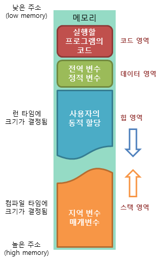
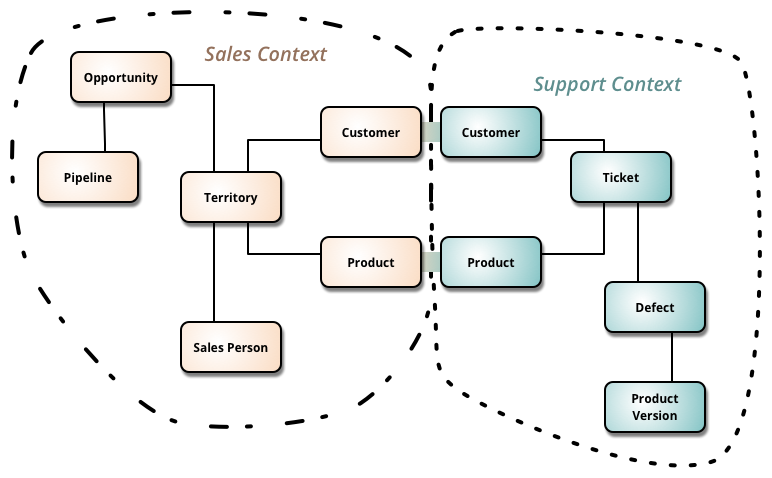
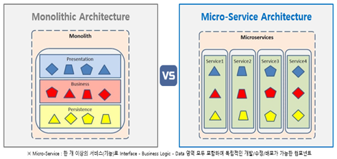

# 1. 프로그래밍 공통

### [ OOP란 ]
OOP는 현실 세계를 프로그래밍으로 옮겨와 현실 세계의 사물들을 객체로 보고, 그 객체로부터 개발하고자 하는 특징과 기능을 뽑아와 프로그래밍하는 기법입니다. OOP로 코드를 작성하면 재사용성과 변형가능성을 높일 수 있습니다.

   
### [ OOP의 5가지 설계 원칙 ]
- SRP(Single Responsibility Principle, 단일 책임 원칙): 클래스는 단 하나의 목적을 가져야 하며, 클래스를 변경하는 이유는 단 하나의 이유여야 한다.
- OCP(Open-Closed Principle, 개방 폐쇠 원칙): 클래스는 확장에는 열려 있고, 변경에는 닫혀 있어야 한다.
- LSP(Liskov Substitution Principle, 리스코프 치환 원칙): 상위 타입의 객체를 하위 타입으로 바꾸어도 프로그램은 일관되게 동작해야 한다.
- ISP(Interface Segregation Principle, 인터페이스 분리 원칙): 클라이언트는 이용하지 않는 메소드에 의존하지 않도록 인터페이스를 분리해야 한다.
- DIP(Dependency Inversion Principle, 의존 역전 법칙): 클라이언트는 추상화(인터페이스)에 의존해야 하며, 구체화(구현된 클래스)에 의존해선 안된다.


### [ 절차지향 프로그래밍 VS 객체지향 프로그래밍 ]


- 절차지향 프로그래밍 
   - 물이 위에서 아래로 흐르는 것처럼 순차적인 처리를 중요시하는 프로그래밍 기법이다.
   - 가장 대표적인 언어로 C언어가 있다.
   - 컴퓨터의 처리구조와 유사해 실행속도가 빠르다.
   - 코드의 순서가 바뀌면 동일한 결과를 보장하기 어렵다.

- 객체지향 프로그래밍
   - 실제 세계의 사물들을 객체로 모델링하여 개발을 진행하는 프로그래밍 기법
   - 가장 대표적인 언어로 Java가 있다.
   - 캡슐화, 상속, 다형성 등과 같은 기법을 이용할 수 있다. 다형성은 동일한 키보드의 키가 다른 역할을 하는 것처럼 하나의 메소드나 클래스가 다양한 방법으로 동작하는 것을 의미한다.
   - 절치지향 언어보다 실행속도가 느리다.
   

### [ RESTful API ]
REST(REpresentational State Transfer)ful API는 HTTP 통신에서 어떤 차원에 대한 CRUD 요청을 Resource와 Method로 표현하여 특정한 형태로 전달하는 방식입니다. RESTful API는 아래와 같은 것들로 구성됩니다.


- Resource(자원, URI)
- Method(요청 방식, GET or POST 등)
- Representation of Resource(자원의 형태, JSON or XML 등)


### [ 함수형 프로그래밍 ]
함수평 프로그래밍의 가장 큰 특징은 immutable data와 first class citizen으로서의 함수입니다. 함수형 프로그래밍은 부수효과가 없는 순수 함수를 이용하여 프로그램을 만드는 것이다. 부수 효과가 없는 순수 함수란 데이터의 값을 변경시키지 않으며 객체의 필드를 설정하는 등의 작업을 하지 않는 함수를 의미합니다.

❗️ first class citizen (1급객체)는 아래 3 가지조건을 충족한다면 1급 객체라고 할수 있습니다.

1. 함수를 변수나 데이타에 할당 할 수 있어야 한다.
2. 함수를 객체의 인자로 넘길 수 있어야 한다.
3. 함수를 객체의 리턴값으로 리턴 할수 있어야 한다.


### [ 메모리 구조 ]



- 코드 영역: 실행할 프로그램의 코드가 저장되는 영역으로 텍스트 영역이라고도 부릅니다. 사용자가 프로그램 실행 명령을 내리면 OS가 HDD에서 메모리로 실행 코드를 올리게 되고, CPU는 코드 영역에 저장된 명령어를 하나씩 처리하게 됩니다.
- 데이터 영역: 프로그램의 전역 변수(global)와 정적 변수(static)가 저장되는 영역입니다. 데이터 영역은 프로그램의 시작과 함께 할당되며, 프로그램이 종료되면 소멸합니다.
- 힙 영역: 프로그래머가 직접 관리할 수 있는 메모리 영역으로 이 공간에 메모리를 할당하는 것을 동적 할당이라고 부릅니다. Java에서는 가비지 컬렉터가 자동으로 해제해줍니다. 힙 영역은 스택 영역과 달리 낮은 주소에서 높은 주소로 메모리가 할당됩니다.
- 스택 영역: 함수의 호출과 함께 할당되며 지역 변수와 매개 변수가 저장되는 영역입니다. 스택 영역에 저장되는 함수의 호출 정보를 스택프레임이라고 합니다. 스택 영역은 함수의 호출이 완료되면 소멸합니다. 스택 영역은 높은 주소에서 낮은 주소로 메모리가 할당됩니다.


### [ Parameter와 Argument의 차이 ]


- Parameter: 함수를 선언할 때 사용된 변수
- Argument: 함수가 호출되었을 때 함수의 파라미터로 전달된 실제 값


### [ Call By Value와 Call By Reference 차이 ]


- Call By Value
  - 인자로 받은 값을 복사하여 처리하는 방식
  - Call By Value에 의해 넘어온 값을 증가시켜도 원래의 값이 보존된다.
  - 값을 복사하여 넘기기 때문에 메모리 사용량이 늘어난다.
- Call By Reference
  - 인자로 받은 값의 주소를 참조하여 직접 값에 영향을 주는 방식
  - 값을 복사하지 않고 직접 참조하기 때문에 속도가 빠르다.
  - 원래의 값에 영향을 주는 리스크가 존재한다.


예를 들어 아래와 같은 코드가 있다고 할 때, a라는 새로운 변수가 생성되어 Call By Value로 전달되기 때문에 메모리를 많이 사용하지만 a를 변경하여도 원래 값인 f는 영향을 받지 않습니다.

```java
public class Main {

     public static void main(String[] args) {
          Foo f = new Foo("f");
          changeReference(f); // It won't change the reference!
          modifyReference(f); // It will modify the object that the reference variable "f" refers to!
     }

     public static void changeReference(Foo a) {
          Foo b = new Foo("b");
          a = b;
     }

     public static void modifyReference(Foo c) {
          c.setAttribute("c");
     }

}
```

### [ 프레임워크와 라이브러리 차이 ]


- 라이브러리: 사용자가 흐름에 대한 제어를 하며 필요한 상황에 가져다가 쓸 수 있다.
- 프레임워크: 전체적인 흐름을 자체적으로 제어한다.


프레임워크와 라이브러리는 실행 흐름에 대한 제어 권한이 어디 있는지에 따라 달라집니다. 프레임워크를 사용하면 사용자가 관리해야 하는 부분을 프레임워크에 넘김으로써 신경써야 할 것을 줄이는 제어의 역전(IoC, Inversion Of Control)이 적용됩니다.


### [ 병렬 처리 프레임워크의 종류와 특징 ]


- Hadoop 
  - HDFS(Hadoop Distributed File System)를 활용해 데이터를 주고 받는다.
  - 데이터가 여러 노드에 분산되어 저장되기 때문에 손실의 우려가 없다는 장점이 있다.
  - 하지만 File I/O를 기반으로 작동하기 때문에 처리 속도가 느리다.
- Spark
  - In-Memory 상 에서 데이터를 주고받고 연산을 수행한다.
  - 메모리를 사용해 데이터를 처리하기 때문에 Hadoop보다 속도가 약 100배 정도 빠르다.
  - 하지만 메모리상에서 처리하기 때문에 장애가 발생한 경우 응용 프로그램을 처음부터 다시 시작해야 한다.


### [ 동기와 비동기의 차이 ]


- 동기(Synchronous) 방식
  - 요청을 보내고 실행이 끝나면 다음 동작을 처리하는 방식
  - 순서에 맞추어 진행되기 때문에 제어하기 쉽다.
  - 여러가지 요청을 동시에 처리할 수 없어 효율이 떨어진다.
  - 동기 방식의 예시로는 콜센터 종업원이 일을 처리하는 방식이 될 수 있다. 콜센터의 직원은 한 손님의 전화 응대가 끝난 후에 다음 손님의 응대를 진행할 수 있다.
- 비동기(Asynchronous) 방식
  - 요청을 보내고 해당 동작의 처리 여부와 상관없이 다음 요청이 동작하는 방식
  - 작업이 완료되는 시간을 기다릴 필요가 없기 때문에 자원을 효율적으로 사용할 수 있다.
  - 작업이 완료된 결과를 제어하기 어렵다.
  - 비동기 방식의 예제로는 이메일이 있다. 우리는 한 사람에게 이메일을 보냈을 때 답변을 받지 않고도 이메일을 다시 보낼 수 있다.


### [ SQL Injection ]
SQL Injection이란 공격자가 악의적인 의도를 갖는 구문을 삽입하여 공격자가 원하는 SQL을 실행하도록 하는 웹해킹기법입니다. 예를 들어 아래와 같은 간단한 SQL 문이 있을 때 INPUT1에 'OR 1=1--을 넣는 것입니다.

```sql
SELECT * FROM USER WHERE ID = 'INPUT1' AND PASSWORD = 'INPUT2'

SELECT * FROM USER WHERE ID = '' OR 1=1 --INPUT1' AND PASSWORD = 'INPUT2'
```
INPUT1으로 'OR 1=1--을 넣으면 보이는 것처럼 뒤의 내용은 주석처리가 되고 WHERE 문은 항상 참이 됩니다.

이러한 공격을 방지하기 위해 특수문자 및 SQL 예약어들을 필터링하거나 SQL 오류 메세지를 노출하지 않는 등의 방법을 취해야 합니다.


# 1. 프로그래밍 공통 - 고급
###  [ 메세지 큐(Message Queue)란? ]
   메세지 큐(Message Queue)란 Queue 자료구조를 이용하여 데이터(메세지)를 관리하는 시스템으로, 비동기 통신 프로토콜을 제공하여 메세지를 빠르게 주고 받을 수 있게 해준다. 메세지 큐에서는 Producer(생산자)가 Message를 Queue에 넣어두면, Consumer가 Message를 가져와 처리하게 된다. 메세지 큐에는 Kafka, Rabbit MQ, AMPQ 등이 있다.


### [ Docker(도커)와 Kubernates(쿠버네티스) ]
Docker는 컨테이너 기반의 가상화 기술입니다. 기존에는 하드웨어를 가상화하였기 때문에 Host OS 위에 Guest OS를 설치해야 했습니다. 하지만 이러한 방식은 상당히 무겁고 느려 한계가 많이 있었습니다.

그래서 이를 극복하고자 프로세스를 격리시킨 컨테이너를 통해 가상화를 하는 Docker(도커)와 같은 기술들이 등장하게 되었고, 도커를 통해 구동되는 컨테이너를 관리하기 위한 Kubernates(쿠버네티스)가 등장하게 되었습니다.


### [ Docker(도커)의 장/단점 ]
- 장점
  - 쉽고 빠른 실행 환경 구축
  - 하드웨어 자원 절감
  - Docker Hub와 같은 공유 환경 제공
- 단점
  - 개발 초기의 오버헤드
  - Linux 친화적


### [ TDD(Test-Driven Development) ]
TDD(Test-Driven Development)는 매우 짧은 개발 사이클의 반복에 의존하는 개발 프로세스로, 개발자는 우선 요구되는 기능에 대한 테스트케이스를 작성하고, 그에 맞는 코드를 작성하여 테스트를 통과한 후에 상황에 맞게 리팩토링하는 테스트 주도 개발 방식을 의미합니다.

개발자는 테스트를 작성하기 위해 해당 기능의 요구사항을 확실히 이해해야 하기 때문에 개발 전에 요구사항에 집중할 수 있도록 도와주지만 테스트를 위한 진입 장벽과 작성해야 하는 코드의 증가는 단점으로 뽑힙니다.


### [ DDD(Domain-Driven Design) ]
DDD(Domain-Driven Design)는 실세계에서 사건이 발생하는 집합인 Domain(도메인)을 중심으로 설계하는 방법입니다. 옷 쇼핑몰을 예로 들면 손님들이 주문하는 도메인, 점주들이 관리하는 도메인 등이 있을 수 있습니다. 이러한 도메인들이 서로 상호작용하며 설계하는 것이 도메인 주도 설계입니다. 도메인 주도 설계에서 도메인은 각각 분리되어 있는데, 이러한 관점에서 MSA(MicroService Architecture)를 적용하면 용이한 설계를 할 수 있다. DDD에서는 같은 객체들이 존재할 수 있는데, 예를 들어 옷 구매자의 입장에서는 (name, price)와 같은 객체 정보를 담지만, 판매자의 입장에서는(madeTie, size, madeCountry) 등이 있을 수 있습니다. 즉, 문맥에 따라 객체의 역할이 바뀔 수 있는 것이 DDD입니다.




[ MSA란? ]
MSA(Microservice Architecture)는 모든 시스템의 구성요소가 한 프로젝트에 통합되어 있는 Monolithic Architecture(모놀리식 아키텍쳐)의 한계점을 극복하고자 등장하게 되었습니다. MSA는 1개의 시스템을 독리접으로 배포가능한 각각의 서비스로 분할합니다. 각각의 서비스는 RESTful API를 통해 데이터를 주고받으며 1개의 큰 서비스를 구성합니다.



- 장점
  - 일부 서비스에 장애가 발생하여도 전체 서비스에 장애가 발생하지 않는다.
  - 각각의 서비스들은 서로 다른 언어와 프레임워크로 구성될 수 있다.
  - 서비스의 확장이 용이하다.
- 단점
  - 서비스가 분리되어 있어, 테스팅이나 트랜잭션 처리 등이 어렵다.
  - 서비스 간에 RESTful API로 통신하기 때문에 그에 대한 비용이 발생한다.
  - 서비스간의 호출이 연속적이기 때문에 디버깅이 어렵다.


출처: https://mangkyu.tistory.com/88 [MangKyu's Diary]