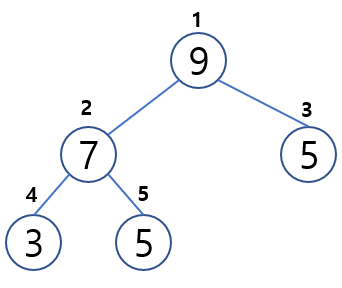
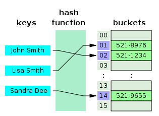
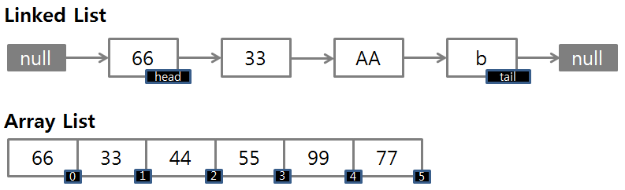

# 2. 자료구조
###  [ 자료구조와 알고리즘 ]
자료구조는 데이터를 원하는 규칙 또는 목적에 맞게 저장하기 위한 구조이고, 알고리즘이란 자료구조에 쌓인 데이터를 활용해 어떠한 문제를 해결하기 위한 여러 동작들의 모임입니다.

### [ 스택, 큐, 트리, 힙 구조 설명 ]
- 스택: 세로로 된 바구니와 같은 구조로 먼저 넣게 되는 자료가 마지막으로 나오게 되는 First-In Last-Out(FILO) 구조이다.
- 큐: 가로로 된 통과 같은 구조로 먼저 넣게 되는 자료가 가장 먼저 나오는 First-In First-Out(FIFO) 구조이다.
- 트리: 정점과 간선을 이용해 사이클을 이루지 않도록 구성한 Graph의 특수한 형태로, 계층이 있는 데이터를 표현하기에 적합하다.
- 힙: 최댓값 또는 최솟값을 찾아내는 연산을 쉽게 하기 위해 고안된 구조로, 각 노드의 키값이 자식의 키값보다 작지 않거나(최대힙) 그 자식의 키값보다 크지 않은(최소힙) 완전이진트리이다.

### [ 우선순위 큐와 내부 구조 및 시간복잡도 ]
우선순위큐는 가장 우선순위가 높은 데이터를 먼저 꺼내기 위해 고안된 자료구조입니다. 우선순위 큐를 구현하기 위해서 일반적으로 힙을 사용합니다. 힙은 완전이진트리를 통해서 구현되었기 때문에 우선순위 큐의 시간복잡도는 O(logn)입니다.

### [ 해시 테이블와 해시 테이블의 시간 복잡도 ]
해시 테이블은 (Key, Value)로 데이터를 저장하는 자료구조 중 하나로 빠른 데이터 검색이 필요할 때 유용합니다. 해시 테이블은 Key값에 해시함수를 적용해 고유한 index를 생성하여 그 index에 저장된 값을 꺼내오는 구조입니다.

해시 테이블은 고유한 index로 값을 조회하기 때문에 평균적으로 O(1)의 시간복잡도를 갖습니다. 하지만 해시의 index값이 충돌이 발생한 경우 충돌된 index값에 대해 연결된 데이터들을 조회하여 원하는 값을 조회하기 때문에 O(N)까지 증가할 수 있습니다.

### [ LinkedList와 ArrayList 차이 ]
ArrayList는 데이터들이 순서대로 늘어선 배열의 형식을 취하고 있지만, LinkedList는 자료의 주소값으로 서로 연결된 형식을 가지고 있습니다. 이러한 구조에 의해 둘은 각각의 장단점을 가지고 있습니다.

- ArrayList
  - 원하는 데이터에 무작위로 접근할 수 있다.
  - 리스트의 크기가 제한되어 있으며, 리스트의 크기를 재조정하는 것은 많은 연산이 필요하다.
  - 데이터의 추가/삭제를 위해서는 임시 배열을 생성하여 복제하고 있어 시간이 오래 걸린다.
- LinkedList
  - 리스트의 크기에 영향 없이 데이터를 추가할 수 있다.
  - 데이터를 추가하기 위해 새로운 노드를 생성하여 연결하므로 추가/삭제 연산이 빠르다.
  - 무작위 접근이 불가능하며, 순차 접근만이 가능하다.

### [ 큐와 스택의 구현 ]
- 큐(Queue): Array로 구현하면 poll 연산 이후 객체를 앞당기는 작업이 필요하다. 하지만 List로 구현하면 객체 1개만 제거하면 되므로 삽입 및 삭제가 용이한 LinkedList로 구현하는 것이 좋다.
- 스택(Stack): List로 구현하면 객체를 제거하는 작업이 필요하다. 하지만 Array로 구현하면 삭제할 필요 없이 index를 줄이고 초기화만 하면 되므로, Array로 구현하는 것이 좋다.

# 2. 자료구조 - 고급

### [ AVL 트리 ]
AVL 트리란 한 쪽으로 값이 치우치는 이진 균형 트리(Balanced Search Tree, BST)의 한계점을 보완하기 위해 만들어진 균형 잡힌 이진 트리입니다. AVL은 항상 좌/우로 데이터를 균형잡힌 상태로 유지하기 위해 추가적인 연산을 진행합니다.

### [ 레드블랙 트리 ]
레드블랙 트리는 모든 노드를 빨간색 또는 검은색으로 색칠합니다. 그리고 연결된 노드들은 색이 중복되지 않도록 관리됩니다.

출처: https://mangkyu.tistory.com/89 [MangKyu's Diary]