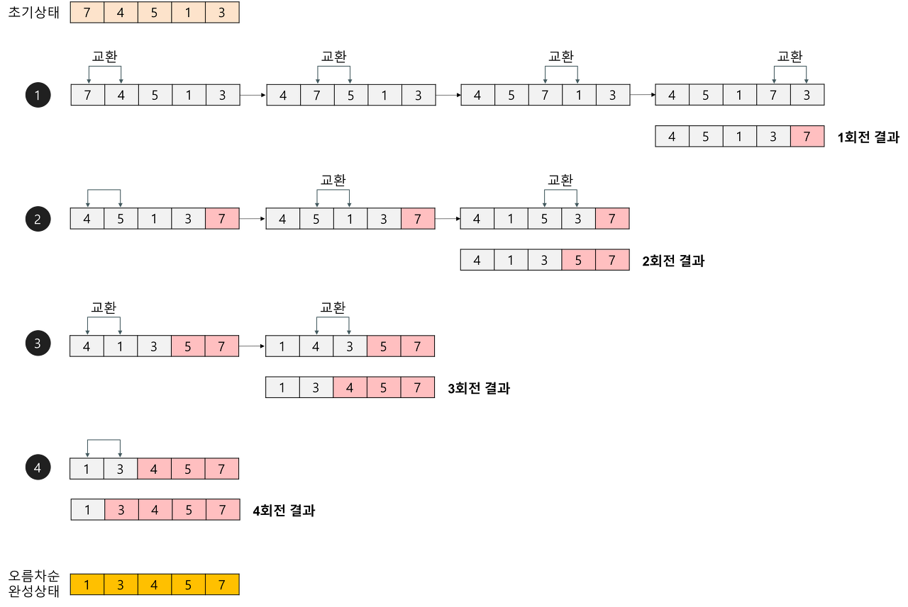
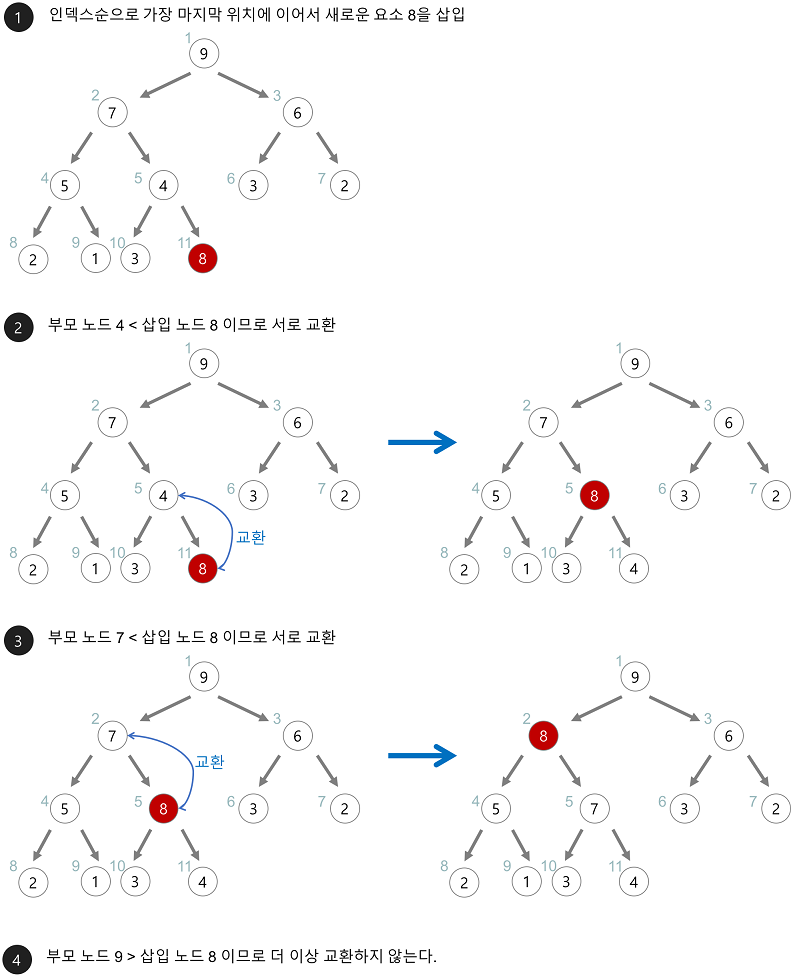
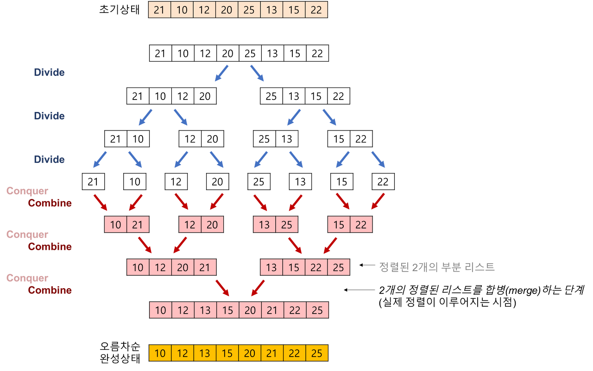
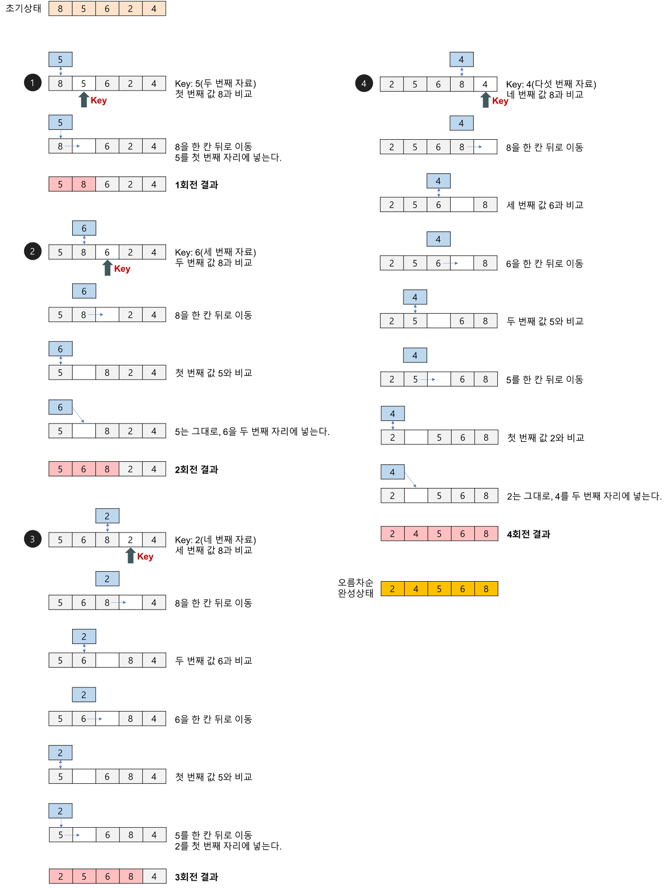
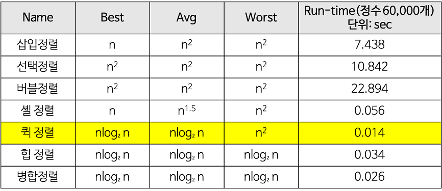
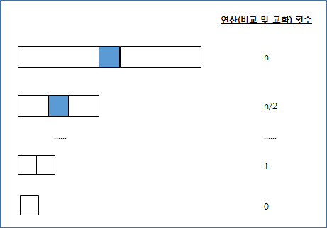
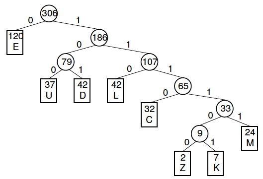

# 3. 알고리즘

### [ 버블소트, 힙소트, 머지소트, 퀵소트, 삽입소트 ]
버블소트는 서로 인접한 두 원소를 비교하여 정렬하는 알고리즘입니다. 0번 인덱스부터 n-1번 인덱스까지 n번까지의 모든 인덱스를 비교하며 정렬합니다. 시간복잡도는 O(n2) 입니다.




힙소트는 주어진 데이터를 힙 자료구조로 만들어 최대값 또는 최소값부터 하나씩 꺼내서 정렬하는 알고리즘입니다. 힙소트가 가장 유용한 경우는 전체를 정렬하는 것이 아니라 가장 큰 값 몇개만을 필요로 하는 경우입니다. 시간복잡도는 O(nlog2n) 입니다.




머지소트는 주어진 배열을 크기가 1인 배열로 분할하고 합병하면서 정렬을 진행하는 분할/정복 알고리즘입니다. 시간복잡도는 O(nlog2n) 입니다.




퀵소트는 매우 빠른 정렬 속도를 자랑하는 분할 정복 알고리즘 중 하나로 합병정렬과 달리 리스트를 비균등하게 분할합니다. 피봇을 설정하고 피봇보다 큰값과 작은값으로 분할하여 정렬을 합니다. 시간복잡도는 O(nlog2n) 이며 리스트가 계속해서 불균등하게 나눠지는 경우 시간복잡도가 O(n2) 까지 나빠질 수 있습니다.


삽입정렬은 두 번째 값부터 시작하여 그 앞에 존재하는 원소들과 비교하여 삽입할 위치를 찾아 삽입하는 정렬 알고리즘입니다. 삽입 정렬의 평균 시간복잡도는 O(n2) 이며, 가장 빠른 경우 O(n) 까지 높아질 수 있습니다.




### [ 정렬 알고리즘 시간복잡도 비교 ]




### [ 동적 프로그래밍(Dynamic Programming)이란? ]
동적 프로그래밍(Dynamic Programming) 이란 주어진 문제를 풀기 위해서, 문제를 여러 개의 하위 문제(subproblem)로 나누어 푼 다음, 그것을 결합하여 해결하는 방식입니다. 동적 프로그래밍에서는 어떤 부분 문제가 다른 문제들을 해결하는데 사용될 수 있어, 답을 여러 번 계산하는 대신 한 번만 계산하고 그 결과를 재활용하는 메모이제이션(Memoization) 기법으로 속도를 향상 시킬 수 있습니다.


### [ 동적 프로그래밍(Dynamic Programming)의 두 가지 조건 ]
동적 프로그래밍(Dynamic Programming)으로 문제를 해결하기 위해서는 주어진 문제가 다음의 조건을 만족해야 한다.

- Overlapping Subproblem(중복되는 부분문제): 주어진 문제는 같은 부분 문제가 여러번 재사용된다.
- Optimal Substructure(최적 부분구조): 새로운 부분 문제의 정답을 다른 부분 문제의 정답으로부터 구할 수 있다.

### [ 재귀 알고리즘과 재귀의 시간 복잡도 ]
재귀 알고리즘이란 함수 내부에서 함수가 자기 자신을 또 다시 호출하여 문제를 해결하는 알고리즘입니다. 재귀 알고리즘은 자기가 계속해서 자신을 호출하므로 끝없이 반복되게 되므로 반복을 중단할 조건이 반드시 필요합니다.

팩토리얼을 계산하는 재귀 함수에서는 T(n) = T(n-1) + c (C는 n과 f(n-1)을 곱하는 비용)을 조회하고 점화식을 계산하면 아래와 같이 O(n)이 됨을 보일 수 있습니다.

```text
T(n) = T(n-1) + c
   = T(n-2) + 2c
   = T(n-3) + 3c
   = ……
   = T(2) + (n-2)c
   = T(1) + (n-1)c
   ≤ c + (n-1)c = c + cn - c = cn --> O(n)
```

### [ 팩토리얼의 재귀/반복문 손코딩 ]
```text
private static int recursiveFactorial(int num) {
     if(num > 1) {
        return recursiveFactorial(num - 1) * num;
     }
     return 1;
}

private static int loopFactorial(int num) {
     int answer = 1;
     for (int i = 2; i <= num; i++) {
        answer *= i;
     }
     return answer;
}
```

### [ 피보나치 수열 재귀/반복문 손코딩 ]

```text
   private static int recursiveFibonacci(int index) {
      if (index <= 2){
          return 1;
      }
      return recursiveFibonacci(index - 1) + recursiveFibonacci(index - 2);
   }

    private static int loopFibonacci(int index) {
        int answer = 1;
        int before = 1;
        int temp;
        for (int i = 2; i < index; i++) {
            temp = answer;
            answer += before;
            before = temp;
        }
        return answer;
    }
```

# 3. 알고리즘 - 고급
   
### [ n개의 배열에서 k(k<=n) 번째로 큰수를 찾는 알고리즘 ]
   
이러한 문제를 해결하기 위해 일반적으로 퀵정렬을 사용합니다. 하지만 퀵정렬을 사용하면 정렬이 불필요한 부분들을 정렬하면서 효율적이지 못하게 됩니다. 퀵선택 알고리즘은 퀵정렬을 한 후에 피봇과 K를 비교하여 아래와 같이 수행합니다.

- pivot의 인덱스가 k와 같은 경우 : 그대로 그 인덱스의 값을 리턴하면 된다.
- pivot의 인덱스가 k보다 작은 경우 : pivot의 인덱스+1부터 마지막 인덱스까지 다시 Partition함수에 넘겨준다.
- pivot의 인덱스가 k보다 큰 경우 : 첫번째 인덱스부터 pivot의 인덱스-1까지 다시 Partition함수에 넘겨준다.

퀵정렬 알고리즘과의 다른 점은 예를 들어 Pivot의 인덱스가 7이고 K가 5인 경우에, 피봇의 오른쪽 부분은 재귀 함수를 돌지 않아 한 쪽만으로 재귀를 진행하는 것입니다.
이러한 이유로 퀵선택 알고리즘의 시간복잡도는 n+n/2+4/n+....1=O(n) 입니다.



### [ 허프만 코딩이란 ]
허프만 코딩은 문자의 빈도를 이용해 압축하는 방법으로 빈도가 높은 문자에 짧은 코드를 부여합니다. 허프만 코드는 접두부 코드와 최적 코드를 사용합니다.

- 접두부 코드: 문자에 부여된 코드가 다른 이진 코드의 접두부가 되지 않는 코드
- 최적코드: 인코딩된 메세지의 길이가 가장 짧은 코드



[ 특정 수 이하의 3과 5의 배수의 합 구하기 손코딩 ]
```text
private static int addMultipleOf3And5(int maxNum) {
   int div = maxNum / 3;
   int sum3 = (1 + div) * div * 3 / 2 ;
   div = maxNum / 5;
   int sum5 = (1 + div) * div * 5 / 2 ;
   div = maxNum / 15;
   int sum15 = (1 + div) * div * 15 / 2 ;
   return sum3 + sum5 - sum15;
}
```


출처: https://mangkyu.tistory.com/90 [MangKyu's Diary]