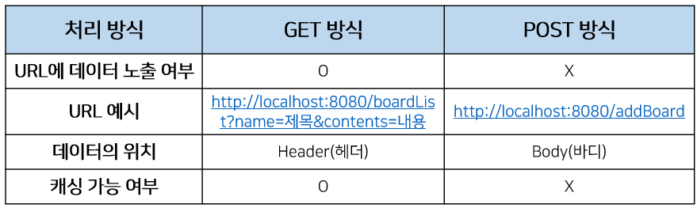
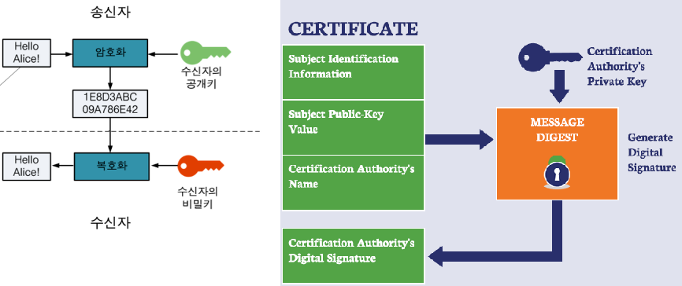
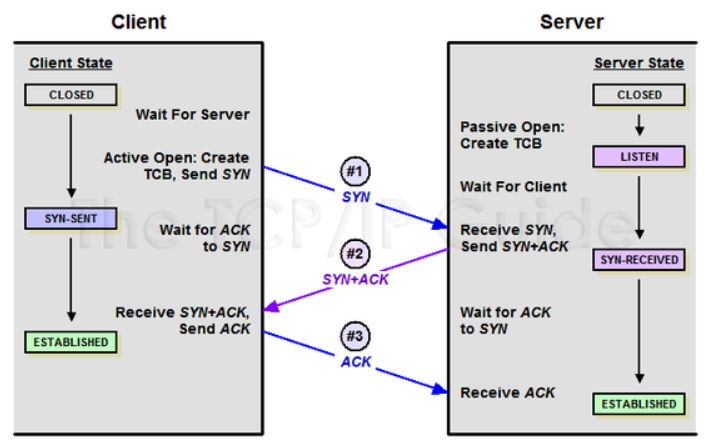

# 4. 네트워크
  
### [ 웹 동작 방식 ]

1. 사용자가 브라우저에 URL을 입력
2. 브라우저는 DNS를 통해 서버의 진짜 주소를 찾음
3. HTTP 프로토콜을 사용하여 HTTP 요청 메세지를 생성함
4. TCP/IP 연결을 통해 HTTP요청이 서버로 전송됨
5. 서버는 HTTP 프로토콜을 활용해 HTTP 응답 메세지를 생성함
6. TCP/IP 연결을 통해 요청한 컴퓨터로 전송
7. 도착한 HTTP 응답 메세지는 웹페이지 데이터로 변환되고, 웹 브라우저에 의해 출력되어 사용자가 볼 수 있게 됨

### [ TCP와 UDP 차이 ]
TCP는 연결형 서비스로 3-way handshaking 과정을 통해 연결을 설정합니다. 그렇기 때문에 높은 신뢰성을 보장하지만 속도가 비교적 느리다는 단점이 있습니다. UDP는 비연결형 서비스로 3-way handshaking을 사용하지 않기 때문에 신뢰성이 떨어지는 단점이 있습니다. 하지만 수신 여부를 확인하지 않기 때문에 속도가 빠릅니다. TCP는 신뢰성이 중요한 파일 교환과 같은 경우에 쓰이고 UDP는 실시간성이 중요한 스트리밍에 자주 사용됩니다.

### [ GET과 POST 차이 ]
GET은 데이터를 조회하기 위해 사용되는 방식으로 데이터를 헤더에 추가하여 전송하는 방식입니다. URL에 데이터가 노출되기 때문에 보안적으로 중요한 데이터를 포함해서는 안됩니다.

POST는 데이터를 추가 또는 수정하기 위해 사용되는 방식으로 데이터를 바디에 추가하여 전송하는 방식입니다. 완전히 안전하다는 것은 아니지만 URL에 데이터가 노출되지 않아 GET보다는 안전합니다.

### [ 공인 IP와 사설 IP 차이 ]

- 공인 IP
  - 전세계에서 유일한 IP로 ISP(인터넷 서비스 공급자)가 제공하는 IP주소
  - 외부에 공개되어 있기 때문에 인터넷에 연결된 다른 장비로부터 접근이 가능하다.
  - 그에 따라 방화벽 등과 같은 보안 설정을 해주어야 한다.
- 사설 IP
  - 어떤 네트워크 안에서 사용되는 IP주소
  - IPV4의 부족으로 인해 모든 네트워크가 공인 IP를 사용하는 것이 불가능하기 때문에 네트워크 안에서 라우터를 통해 할당받는 가상의 주소이다.
  - 별도의 설정 없이는 외부에서 접근이 불가능하다.

### [ 웹 접근성의 국제표준 ]

웹 접근성을 높이기 위해 고안된 웹 표준은 웹에서 표준적으로 사용되는 기술이나 규칙을 의미합니다. 웹 표준을 정하기 위하 W3C(World Wide Web Consortium)이 설립되었으며 웹 표준으로 구조 언어인 HTML, 표현 언어인 CSS, 동작 언어인 Script를 지정하였습니다.

-> 작성한 내용이 틀렸다면 지적해주세요!!

[ OSI 7계층 ]

- 7 계층(응용 계층): 사용자와 직접 상호작용하는 응용 프로그램들이 포함된 계층
- 6 계층(표현 계층): 데이터의 형식(Format)을 정의하는 계층
- 5 계층(세션 계층): 컴퓨터끼리 통신을 하기 위해 세션을 만드는 계층
- 4 계층(전송 계층): 최종 수신 프로세스로 데이터의 전송을 담당하는 계층
- 3 계층(네트워크 계층): 패킷을 목적지까지 가장 빠른 길로 전송하기 위한 계층
- 2 계층(데이터링크 계층): 데이터의 물리적인 전송과 에러 검출, 흐름 제어를 담당하는 계층
- 1 계층(물리 계층): 데이터를 전기 신호로 바꾸어주는 계층

### [ HTTP 프로토콜이란? ]
HTTP(Hyper Text Transfer Protocal)이란 서버/클라이언트 모델을 따라 데이터를 주고 받기 위한 프로토콜입니다. HTTP는 애플리케이션 레벨의 프로토콜로 TCP/IP 위에서 작동합니다. HTTP는 상태를 가지고 있지 않는 Stateless 프로토콜이며 Method, Path, Version, Headers, Body 등으로 구성됩니다.

### [ HTTP vs HTTPS ]
HTTP는 평문 데이터를 전송하는 프로토콜이기 때문에, HTTP로 비밀번호나 주민번호 등을 주고 받으면 제3자에 의해 조회될 수 있습니다. 이러한 문제를 해결하기 위해 HTTP에 암호화가 추가된 프로토콜이 HTTPS입니다. HTTPS는 자신의 공개키를 갖는 인증서를 발급하여 보내는 메세지를 공개키로 암호화하도록 하고 있습니다. 공개키로 암호화된 메세지는 개인키를 가지고 있어야만 복호화가 가능하기 때문에, 기업을 제외한 누구도 원본 데이터를 얻을 수 없습니다.

### [ 3 Way-Handshake ]
3 Way-Handshake란 TCP 네트워크에서 통신을 하는 장치가 서로 연결이 잘 되었는지 확인하는 방법입니다. 송신자와 수신자는 총 3번에 걸쳐 데이터를 주고 받으며 통신이 가능한 상태임을 확인합니다.

### [ HTTP 1 vs HTTP 2 ]
HTTP1은 기본적으로 연결당 하나의 요청/응답을 처리하여 다음과 같은 문제를 가지고 있었습니다.

1. HOL(Head Of Line) Blocking (특정 응답 지연): 클라이언트의 요청과 서버의 응답이 동기화되어 지연 발생
2. RTT(Round Trip TIme) 증가 (양방향 지연): 패킷 왕복 시간의 지연 발생
3. 헤더 크기의 비대: 쿠키 등과 같은 메타데이터에 의해 헤더가 비대해짐

그리고 HTTP2는 다음과 같은 기술을 사용하여 HTTP1의 성능 문제를 해결하였습니다.

1. Multiplexed Streams: 하나의 커넥션으로 여러 개의 메세지를 동시에 주고 받을 수 있음
2. Stream Prioritization: 요청온 리소스간의 의존관계를 설정하여 먼저 응답해야하는 리소스를 우선적으로 반환함
3. Header Compression: 헤더 정보를 HPACK 압축 방식을 이용하여 압축 전송함
4. Server Push: HTML문서 상에 필요한 리소스를 클라이언트 요청없이 보내줄 수 있음

출처: https://mangkyu.tistory.com/91 [MangKyu's Diary]