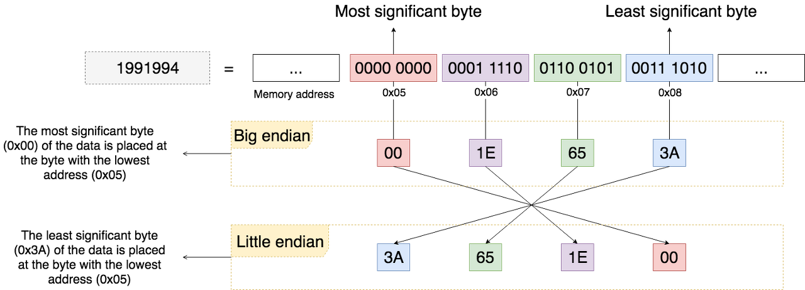
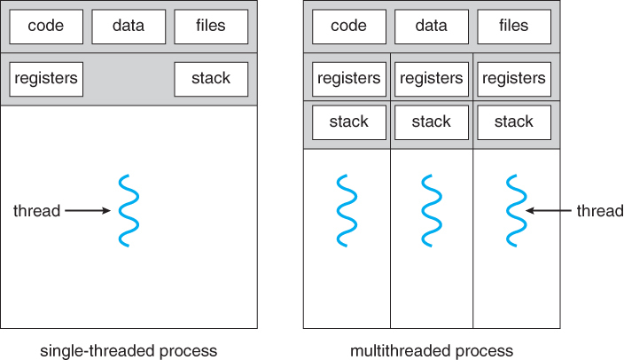
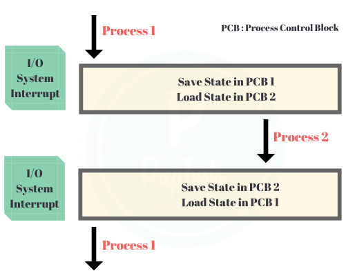
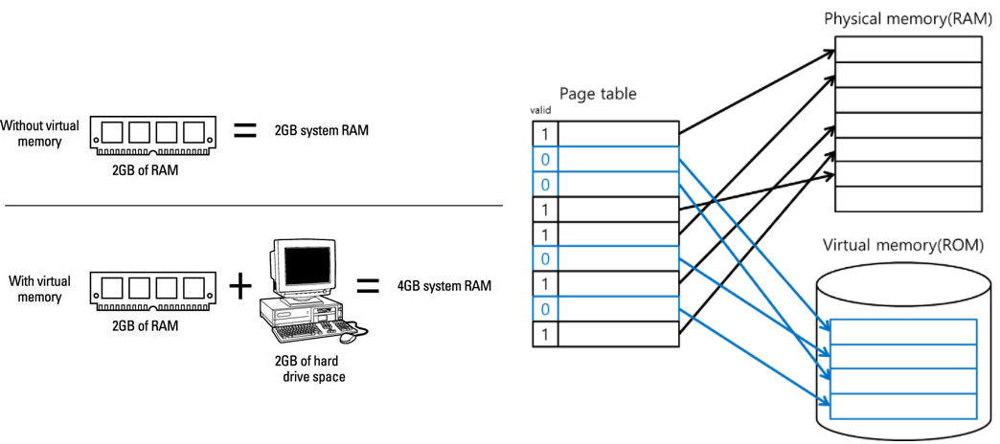
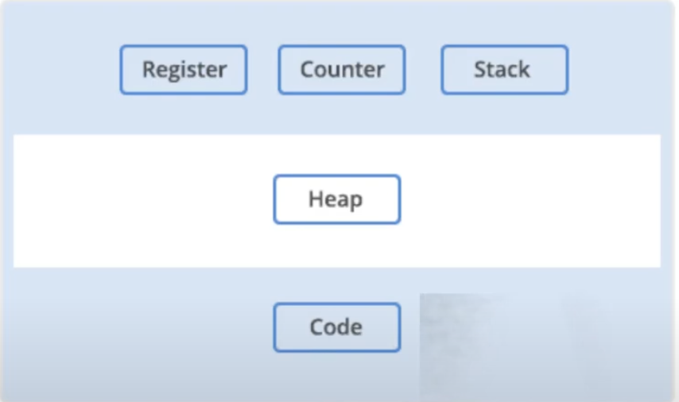
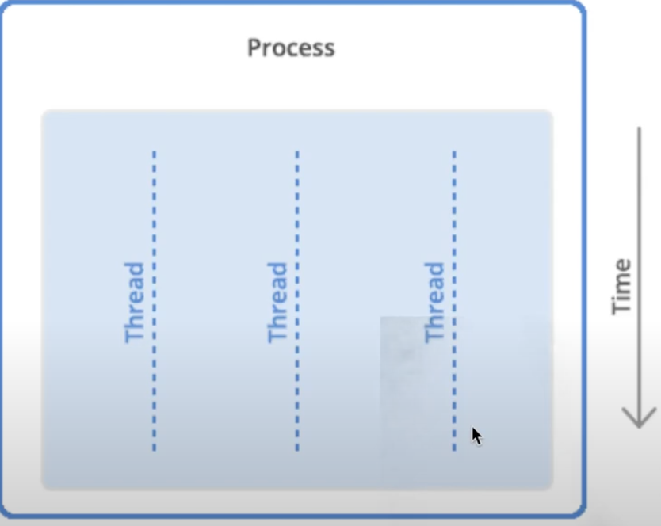
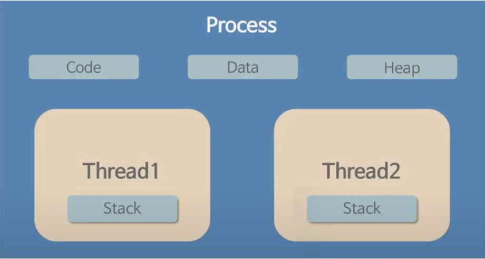
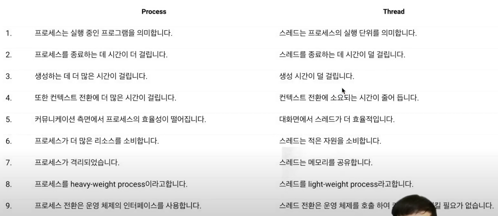
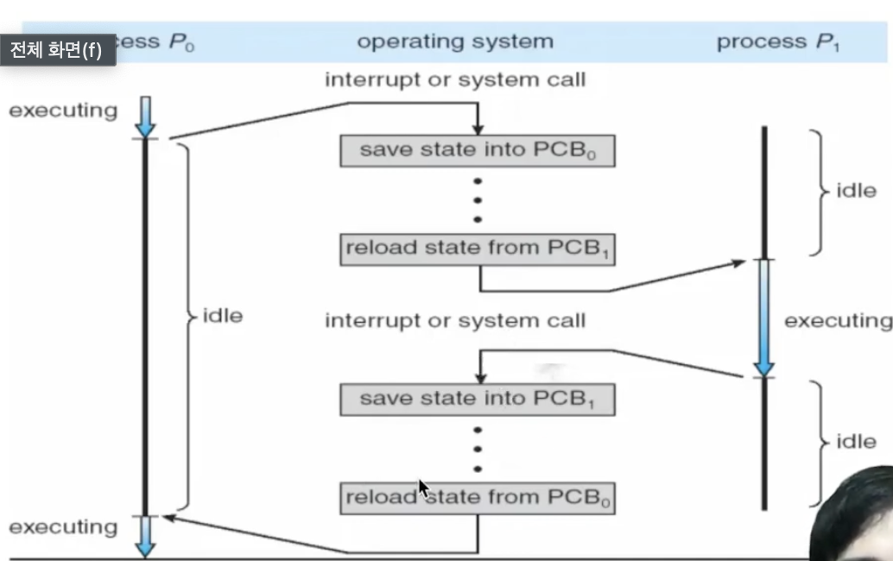
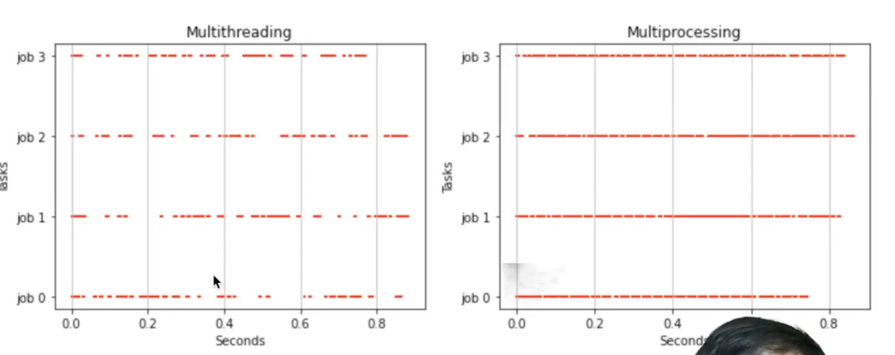

# 5. 운영체제

### [ Byte Ordering이란 ]
Byte Ordering이란 데이터가 저장되는 순서를 의미합니다. Byte Ordering의 방식에는 빅엔디안(Big Endian)과 리틀엔디안(Little Endian)이 있습니다.

- Big Endian
  - MSB가 가장 낮은 주소에 위치하는 저장 방식
  - 네트워크에서 데이터를 전송할 때 주로 사용됨
  - 가장 낮은 주소에 MSB가 저장되므로, offset=0인 Byte를 보면 양수/음수를 바로 파악할 수 있다.
- Little Endian
  - MSB가 가장 높은 주소에 위치하는 방식
  - 마이크로프로세서에서 주로 사용된다.
  - 가장 낮은 주소에 부호값이 아닌 데이터가 먼저 오기 때문에, 바로 연산을 할 수 있다.

### [ 메모리란 ]
메모리는 컴퓨터에서 작업을 수행하기 위해 처리 대상이나 결과 등을 저장하기 위한 공간입니다. 프로그램을 실행하기 위한 정보들은 메모리에 저장되어 처리됩니다.

### [ 프로세스와 쓰레드의 차이 ]

- 프로세스
  - 정의: 메모리에 올라와 실행되고 있는 프로그램의 인스턴스
  - 특징
    - 운영체제로부터 독립된 메모리 영역을 할당받는다. (다른 프로세스의 자원에 접근 X)
    - 프로세스들은 독립적이기 때문에 통신하기 위해 IPC를 사용해야 한다.
    - 프로세스는 최소 1개의 쓰레드(메인 쓰레드)를 가지고 있다.

- 쓰레드
  - 정의: 프로세스 내에서 할당받은 자원을 이용해 동작하는 실행 단위
  - 특징
    - 쓰레드는 프로세스 내에서 Stack만 따로 할당 받고, Code, Data, Heap 영역은 공유한다.
      (Stack을 분리한 이유는 Stack에는 함수의 호출 정보가 저장되는데, Stack을 공유하면 LIFO 구조에 의해 실행 순서가 복잡해지기 때문에 실행 흐름을 원활하게 만들기 위함이다.)
    - 쓰레드는 프로세스의 자원을 공유하기 때문에 다른 쓰레드에 의한 결과를 즉시 확인할 수 있다.
    - 프로세스 내에 존재하며 프로세스가 할당받은 자원을 이용하여 실행된다.

### [ 컨텍스트 스위칭(Context Switching)이란? ]
Context Switching이란 인터럽트를 발생시켜 CPU에서 실행중인 프로세스를 중단하고, 다른 프로세스를 처리하기 위한 과정입니다. Context Switching는 현재 실행중인 프로세스의 상태(Context)를 먼저 저장하고, 다음 프로세스를 동작시켜 작업을 처리한 후에 이전에 저장된 프로세스의 상태를 다시 복구합니다. 여기서 인터럽트란 CPU가 프로세스를 실행하고 있을 때, 입출력 하드웨어 등의 장치나 예외상황이 발생하여 처리가 필요함을 CPU에게 알리는 것을 말합니다.

### [ 멀티 프로세스 VS 멀티 쓰레드 ]

- 멀티 프로세스
  - 하나의 프로그램을 여러 개의 프로세스로 구성하여 각 프로세스가 1개의 작업을 처리하도록 하는 것
  - 특징
    - 1개의 프로세스가 죽어도 자식 프로세스 이외의 다른 프로세스들은 계속 실행된다.
    - Context Switching을 위한 오버헤드(캐시 초기화, 인터럽트 등)가 발생한다.
    - 프로세스는 각각 독립적인 메모리를 할당받았기 때문에 통신하는 것이 어렵다.
- 멀티 쓰레드
  - 하나의 프로그램을 여러 개의 쓰레드로 구성하여 각 쓰레드가 1개의 작업을 처리하도록 하는 것
  - 특징
    - 프로세스를 위해 자원을 할당하는 시스템콜이나 Context Switching의 오버헤드를 줄일 수 있다.
    - 쓰레드는 메모리를 공유하기 때문에, 통신이 쉽고 자원을 효율적으로 사용할 수 있다.
    - 하나의 쓰레드에 문제가 생기면 전체 프로세스가 영향을 받는다.
    - 여러 쓰레드가 하나의 자원에 동시에 접근하는 경우 자원 공유(동기화)의 문제가 발생할 수 있다.

### [ 데드락(DeadLock) 이란? ]
데드락(DeadLock) 또는 교착상태란 한정된 자원을 여러 프로세스가 사용하고자 할 때 발생하는 상황으로, 프로레스가 자원을 얻기 위해 영구적으로 기다리는 상태입니다. 예를 들어 다음과 같은 상황에서 데드락이 발생할 수 있습니다.

자원 A를 가진 프로세스 P1과 자원 B를 가진 프로세스 P2가 있을 때, P1은 B를 필요로 하고 P2는 A를 필요로 한다면 두 프로세스 P1, P2는 서로 자원을 얻기위해 무한정 기다리게 됩니다.

### [ 멀티 쓰레드 프로그래밍 작성 시 유의점 ]
멀티 쓰레드 프로그램을 개발한다면, 다수의 쓰레드가 공유 데이터에 동시에 접근하는 경우에 상호배제 또는 동기화 기법을 통해 동시성 문제 또는 교착 상태가 발생하지 않도록 주의해야 합니다.

### [ 세마포어(Semaphore) vs 뮤텍스(Mutex) 차이 ]
뮤텍스는 Locking 메커니즘으로 락을 걸은 쓰레드만이 임계 영역을 나갈때 락을 해제할 수 있습니다. 하지만 세마포어는 Signaling 메커니즘으로 락을 걸지 않은 쓰레드도 signal을 사용해 락을 해제할 수 있습니다. 세마포어의 카운트를 1로 설정하면 뮤텍스처럼 활용할 수 있습니다.

### [ CPU의 메모리 I/O 도중 생기는 병목 현상 해결 방법 ]
이러한 문제를 해결하기 위해 메모리를 계층화하여 병목현상을 해결하고 있습니다. 자주 접근하는 데이터의 경우에는 캐시에 저장하여 접근 속도를 향상 시킴으로써 부하를 줄이고 있습니다.

# 5. 운영체제 - 고급
   
### [ 가상메모리와 페이지폴트 ]

가상메모리는 RAM의 부족한 용량을 보완하기 위해, 각 프로그램에 실제 메모리 주소가 아닌 가상의 메모리 주소를 할당하는 방식입니다. OS는 프로세스들의 내용(페이지) 중에서 덜 중요한 것들을 하드디스크에 옮겨 놓고, 관련 정보를 페이지 테이블에 기록합니다. CPU는 프로세스를 실행하면서 페이지 테이블을 통해 페이지를 조회하는데, 실제메모리에 원하는 페이지가 없는 상황이 발생할 수 있습니다(Valid bit를 통해 확인). 이것을 페이지 폴트라고 하는데 프로세스가 동작하면서 실제메모리에 필요한 데이터(페이지)가 없으면 가상메모리를 통해서 해당 데이터를 가져오게 됩니다. 가상메모리는 하드디스크에 저장되어 있기 때문에, 페이지폴트가 발생하면 I/O에 의한 속도의 저하가 발생합니다.

### [ 페이지 교체 알고리즘과 LRU(Least Recently Used) ]
LRU(Least Recently Used)는 페이지를 교체하기 위한 알고리즘 중 하나입니다.

페이지를 교체하는 이유는 가상메모리를 통해 조회한 페이지는 다시 사용될 가능성이 높기 때문입니다. 페이지 교체를 위해서는 실제메모리에 존재하는 페이지를 가상메모리로 저장한 후에, 가상메모리에서 조회한 페이지를 실제메모리로 로드해야 됩니다. 그렇다면 어떤 실제메모리의 페이지를 가상메모리로 희생시킬 것이냐에 대한 문제가 발생하는데, 이때 사용하는 알고리즘 중 하나가 LRU(Least Recently Used) 알고리즘 입니다.

LRU 알고리즘은 실제메모리의 페이지들 중에서 가장 오랫동안 사용되지 않은 페이지를 선택하는 방식입니다. 그 외에도 먼저 적재된 페이지를 희생시키는 FIFO(First In First Out) 알고리즘이나 LRU 알고리즘을 응용하여 페이지에 Second-Change를 주는 LRU Approximation 등이 있습니다.

# 5. 운영체제 - 프로세스와 쓰레드 추가 설명

### 프로그램:
- 작업을 위해서 실행할 수 있는 파일 (바이너리 파일)

### 오퍼레이팅 시스템 (Operating System):
- 컴퓨터의 자원을 관리하는 두뇌 역할

### 프로세스:
- 실행되고 있는 컴퓨터 프로그램

### Register:
- cpu에서 명령, 주소들을 가지고 있는 cpu의 하나의 부분

### Counter:
- 프로그램안에서 현재 어느 위치를 실행시키고 있는지 가르키는 용도로 사용

### Stack:
- 펑션 콜스택과 지역변수 저장

### Heap:
- 프로세스가 가지고 있는 메모리에서 위쪽
- 동적할당, 메모리 사이즈 제한이 없음

### Code:
- 메모리가 실행할 코드들을 가지고 있는 공간

### 쓰레드:
- 프로세스의 실행 단위

### Process & Thread

### Process 와 Thread의 차이점

----

## Multiprocessing vs Multithreading

### 멀티태스킹:
- 초기엔 하나의 앱만 실행시킬 수 있었는데 이것이 발전하여 컴퓨터가 한번에
여러가지 작업을 가능하게 되었다.

### Context Switching:
- 프로세스 제어 블록(PCB) 에 cpu의 컨텍스트 상태를 복원하고 저장하여 나중에 같은 시점에서 프로세스 실행을 재개할 수 있는 절차

### 동시성 & 병렬성 (Concurrency & Parallelism):

- 멀티 쓰레딩은 동시성에 가깝고 멀티 프로세싱은 병렬에 가깝다.
- Concurrency 는 하나의 프로세스가 동일한 자원을 가지고 Context switching 을 통해 작업을 진행한다.
- Parallelism은 여러 프로세스가 각각의 자원을 가지고 병렬적으로 처리하는 방법

### 스레드풀 (Thread Pool):
- 스레드 풀을 사용하면 작업 제출과 실행을 분리할 수 있다.

출처: https://mangkyu.tistory.com/92 [MangKyu's Diary]