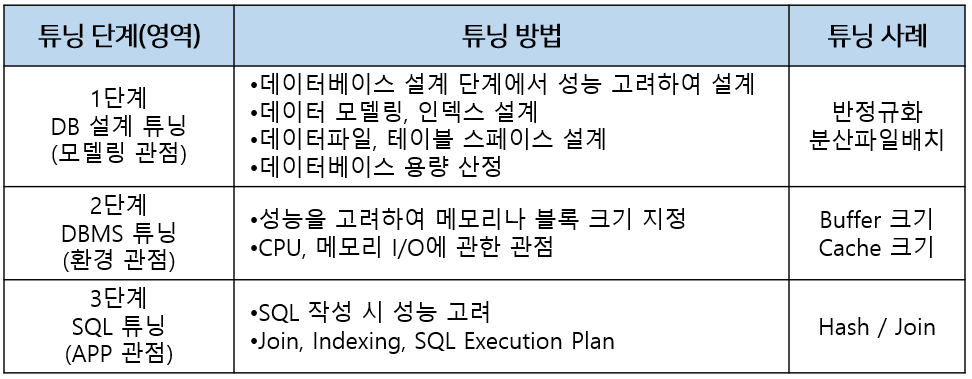

# 6. 데이터베이스
   
### [ 인덱스(index)란? ]
인덱스란 추가적인 쓰기 작업과 저장 공간을 활용하여 데이터베이스 테이블의 검색 속도를 향상시키기 위한 자료구조이다. 만약 우리가 책에서 원하는 내용을 찾는다고 하면, 책의 모든 페이지를 찾아 보는것은 오랜 시간이 걸린다. 그렇기 때문에 책의 저자들은 책의 맨 앞 또는 맨 뒤에 색인을 추가하는데, 데이터베이스의 index는 책의 색인과 같다.

데이터베이스에서도 테이블의 모든 데이터를 검색하면 시간이 오래 걸리기 때문에 데이터와 데이터의 위치를 포함한 자료구조를 생성하여 빠르게 조회할 수 있도록 돕고 있다.

만약 Index를 적용하지 않은 컬럼을 조회한다면, 전체를 탐색하는 Full Scan이 수행된다. Full Scan은 전체를 비교하여 탐색하기 때문에 처리 속도가 떨어진다.


### [ 인덱스의 자료구조 ]
- 해시 테이블
  - 컬럼의 값으로 생성된 해시를 기반으로 인덱스를 구현한다.
  - 시간복잡도가 O(1)이라 검색이 매우 빠르다.
  - 부등호(<, >)와 같은 연속적인 데이터를 위한 순차 검색이 불가능하다.
- B+Tree
  - 자식 노드가 2개 이상인 B-Tree를 개선시킨 자료구조이다.
  - BTree의 리프노드들을 LinkedList로 연결하여 순차 검색을 용이하게 하였다.
  - 해시 테이블보다 나쁜 O(log2n) 의 시간복잡도를 갖지만 해시테이블보다 흔하게 사용된다.


### [ DB 정규화 ]

1. 제1정규형: 모든 속성 값이 원자 값을 갖도록 분해한다.

2. 제2정규형: 제1정규형을 만족하고, 기본키가 아닌 속성이 기본키에 완전 함수 종속이도록 분해한다.
(여기서 완전 함수 종속이란 기본키의 부분집합이 다른 값을 결정하지 않는 것을 의미한다.)

3. 제3정규형: 제2정규형을 만족하고, 기본키가 아닌 속성이 기본키에 직접 종속(비이행적 종속)하도록 분해한다.
(여기서 이행적 종속이란 A->B->C가 성립하는 것으로, 이를 A,B와 B,C로 분해하는 것이 제3정규형이다.)

4. BCNF 정규형: 제3정규형을 만족하고, 함수 종속성 X->Y가 성립할 때 모든 결정자 X가 후보키가 되도록 분해한다.


### [ 트랜잭션(Transaction)이란? ]
하나 이상의 쿼리를 처리할 때 동일한 Connection 객체를 공유하여 에러가 발생한 경우 모든 과정을 되돌리기 위한 방법입니다.


### [ 트랜잭션의 ACID란? ]
- 원자성(Atomicity): 트랜잭션에 포함된 작업은 전부 수행되거나 전부 수행되지 않아야 한다.
- 일관성(Consistency): 트랜잭션을 수행하기 전이나 후나 데이터베이스는 항상 일관된 상태를 유지해야 한다.
- 고립성(Isolation): 수행 중인 트랜잭션에 다른 트랜잭션이 끼어들어 변경중인 데이터 값을 훼손하지 않아야한다.
- 지속성(Durability): 수행을 성공적으로 완료한 트랜잭션은 변경한 데이터를 영구히 저장해야 한다.


### [ 이상 현상의 종류 ]
- 삭제 이상: 튜플 삭제 시 같이 저장된 다른 정보까지 연쇄적으로 삭제되는 현상
- 삽입 이상: 튜플 삽입 시 특정 속성에 해당하는 값이 없어 NULL을 입력해야 하는 현상
- 수정 이상: 튜플 수정 시 중복된 데이터의 일부만 수정되어 일어나는 데이터 불일치 현상


### [ DB 락의 종류 ]
DB 락은 여러 개의 트랜잭션들이 하나의 데이터로 동시에 접근하려고 할 때 이를 제어해주는 도구이다.

- 공유락(LS, Shared Lock): 트랜잭션이 읽기를 할 때 사용하는 락, 데이터를 읽을 수 있지만 쓸 수 없음
- 베타락(LX, Exclusive Lock): 트랜잭션이 읽고 쓰기를 할 때 사용하는 락, 데이터를 읽고 쓸 수 있음


### [ RDBMS와 NoSQL 차이 ]
- RDBMS
  - 2차원의 행과 열로 데이터의 관계를 관리하는 데이터베이스
  - 장점: 스키마에 맞추어 데이터를 관리하기 때문에 데이터의 정합성을 보장할 수 있다.
  - 단점: 시스템이 커질 수록 쿼리가 복잡해지고 성능이 저하되며, 수평적 확장이 어렵다.
- NoSQL
  - RDBMS가 비대해짐에 따라 관계가 복잡해져, 이를 극복하기 위해 등장하게 된 데이터베이스
  - 장점: NOSQL은 스키마 없이 Key-Value 형태로 데이터를 관리하여 좀 더 자유롭게 데이터를 관리할 수 있다.
  - 단점: 중복된 데이터가 추가 가능하여, 이에 대한 관리가 필요하다.


# 6. 데이터베이스 - 고급
   
### [ 힌트(Hint)란? ]
힌트란 SQL을 튜닝하기 위한 지시구문입니다. 옵티마이저가 최적의 계획으로 SQL문을 처리하지 못하는 경우에 개발자가 직접 최적의 실행 계획을 제공하는 것입니다. 힌트는 아래와 같이 SELECT 다음에 작성할 수 있으며, INDEX, PARALLEL 등 다양한 힌트절이 있습니다.

```sql
# 사용가능한 힌트절: PARALLE, INDEX, FULL ...
SELECT /*+ [힌트절] */
```

### [ 클러스터링 vs 리플리케이션 ]

- 리플리케이션
  - 여러 개의 DB를 권한에 따라 수직적인 구조(Master-Slave)로 구축하는 방식이다.
  - 비동기 방식으로 노드들 간의 데이터를 동기화한다.
  - 장점: 비동기 방식으로 데이터가 동기화되어 지연 시간이 거의 없다.
  - 단점: 노드들 간의 데이터가 동기화되지 않아 일관성있는 데이터를 얻지 못할 수 있다.
- 클러스터링
  - 여러 개의 DB를 수평적인 구조로 구축하여 Fail Over한 시스템을 구축하는 방식이다.
  - 동기 방식으로 노드들 간의 데이터를 동기화한다.
  - 장점: 1개의 노드가 죽어도 다른 노드가 살아 있어 시스템을 장애없이 운영할 수 있다.
  - 단점: 여러 노드들 간의 데이터를 동기화하는 시간이 필요하므로 Replciation에 비해 쓰기 성능이 떨어진다.


### [ 데이터베이스 튜닝과 방법 ]
DB 튜닝은 테이터베이스의 구조나 데이터베이스 자체, 운영체제 등을 조정하여 데이터베이스 시스템의 성능을 향상시키는 작업을 의미합니다. 튜닝은 DB 설계 튜닝 -> DBMS 튜닝 > SQL 튜닝의 단계로 진행할 수 있습니다.




출처: https://mangkyu.tistory.com/93 [MangKyu's Diary]