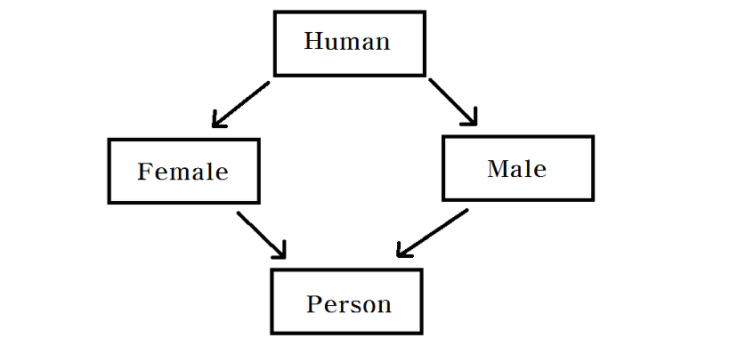
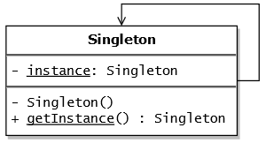
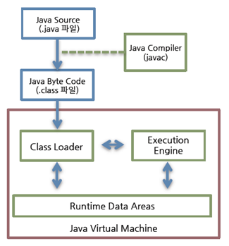
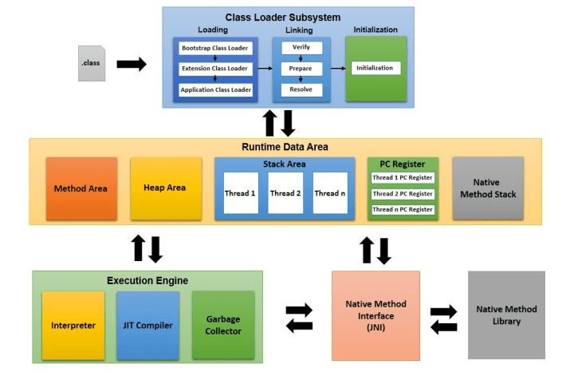
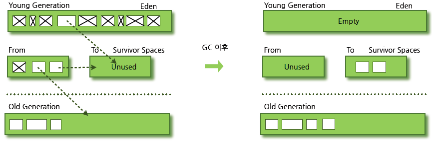
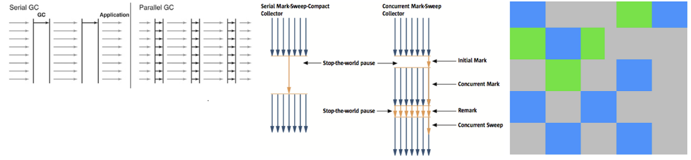
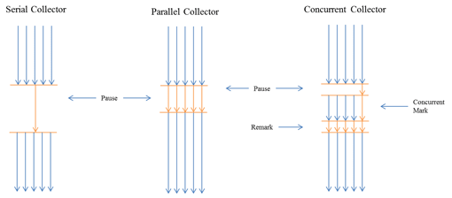

# 7. 개발 언어(Java 위주)
   
### [ Java의 장점과 단점 ]

- 장점
  - JVM 위에서 동작하기 때문에 운영체제에 독립적이다.
  - 가비지컬렉터가 메모리를 관리해주기 때문에 편리하다.
- 단점
  - JVM 위에서 동작하기 때문에 실행 속도가 상대적으로 느리다.
  - 다중 상속이나 타입에 업격하는 등 제약이 있는 것이 많다.


### [ Java가 다중 상속을 지원하지 않는 이유 ]
다중 상속을 지원하면 다이아몬드 문제가 발생할 수 있기 때문입니다. 예를 들어 Human 클래스에 있는 walk() 메소드를 Female 클래스와 Male 클래스가 모두 구현하였다고 할 때, Female과 Male 클래스를 다중 상속 받은 Person 클래스의 입장에서는 코드의 충돌이 생기기 때문입니다.




### [ 오버라이딩(Overriding)과 오버로딩(Overloading) ]

- 오버라이딩(Overriding): 상위 클래스가 가지고 있는 메소드를 하위 클래스에서 재정의하여 사용하는 기술
- 오버로딩(Overloading): 매개변수의 타입과 개수를 변경하면서 같은 이름의 메소드를 여러 개 사용하는 기술

```java
public class Person {
    public void print() {
    System.out.println("나는 사람입니다");
    }
}
    
public class Student extends Person {
    // Overriding
    public void print() {
    System.out.println("나는 학생입니다.");
    }

    // Overloading
    public void print(String name) {
    	System.out.println(name + "는 학생입니다");
    }
}
```

### [ 클래스(Class), 객체(Object), 인스턴스(Instance)의 개념 ]

- 클래스(Class): 객체를 만들어내기 위한 설계도 혹은 틀
- 객체(Object): 설계도(클래스)를 기반으로 선언된 대상, 클래스의 인스턴스라고도 부름
- 인스턴스(Instance): 객체에 메모리가 할당되어 실제로 활용되는 실체

```java
// 클래스
public class Person {
    private String name;
}

public class Main {

    public static void main(String[] args) {
        // 객체 = 클래스의 인스턴스
        Person person;
        
        // 인스턴스
        person = new Person();
    }

}
```


### [ 싱글톤 패턴(Singleton Pattern) 구현 및 사용 이유 ]

```java
public class Person {

    private static Person instance;
    
    public static Person getInstance() {
        if(instance == null){
            instance = new Person();
        }
        return instance;
    }
}
```


싱글톤 패턴은 단 하나의 인스턴스를 생성하여 사용하는 디자인패턴입니다. 싱글톤패턴은 아래의 경우에 사용합니다.

- 해당 인스턴스가 절대적으로 1개만 존재한다는 것을 보증하고 싶은 경우
- 동일한 인스턴스를 자주 생성해주어야 하는 경우(메모리 낭비의 방지)

하지만 이러한 싱글톤 패턴은 객체 지향 설계의 원칙에 적합하지 않으며, LifeCycle 제어가 힘들고, 멀티스레드 환경에서 여러 개의 객체가 생성되는 문제가 발생할 수 있습니다. 그러한 이유로 멀티스레드 환경이라면 static 앞에 synchronized 키워드를 붙여 동기화 작업을 추가해주어야 합니다.(당연히 성능이 저하됩니다).




### [ 추상클래스와 인터페이스의 차이 ]

- 추상클래스
  - 단일 상속만이 가능하다.
  - 모든 접근 제어자를 사용할 수 있다.
  - 변수와 상수를 선언할 수 있다.
  - 추상 메소드와 일반 메소드를 선언할 수 있다.
- 인터페이스
  - 다중 구현이 가능하다.
  - public 접근 제어자만 사용할 수 있다.
  - 상수만 선언할 수 있다.
  - 추상메소드만 선언할 수 있다.

### [ Java의 List, Set, Map 차이 ]

- List
  - 데이터를 순차적으로 저장한다.
  - 데이터의 중복을 허용한다.
  - 데이터로 null을 허용한다.
- Set
  - 순서없이 Key로만 데이터를 저장한다.
  - Key의 중복을 허용하지 않는다.
  - Key로 null을 허용하지 않는다.
- Map
  - 순서없이 Key, Value로 데이터를 저장한다.
  - Value는 중복을 허용하지만 Key의 중복을 허용하지 않는다.
  - Key로 null을 허용하지 않는다.


### [ Java의 Vector와 ArrayList 차이 ]

- Vector
  - 동기화를 지원한다.
  - 속도가 느리지만 병렬 상황에서 안전하다.
  - 크기가 증가하는 경우, 2배 증가함(10 -> 20)
- ArrayList
  - 동기화를 지원하지 않는다. 
  - 속도는 빠르지만 병렬 상황에서 안전하지 않다. 
  - 크기가 증가하는 경우, 1.5배 증가함(10 -> 15)


### [ Java의 StringBuffer와 StringBuilder 차이 ]

- StringBuffer
  - 동기화를 지원한다. 
  - 속도가 느리지만 병렬 상황에서 안전하다.
- StringBuilder
  - 동기화를 지원하지 않는다. 
  - 속도는 빠르지만 병렬 상황에서 안전하지 않다.


### [ synchornized란? ]
Java에서 지원하는 synchronized 키워드는 여러 쓰레드가 하나의 자원을 이용하고자 할 때, 한 스레드가 해당 자원을 사용중인 경우, 데이터에 접근할 수 없도록 막는 키워드입니다. synchronized 키워드를 이용하면 병렬 상황에서 자원의 접근을 안전하게 하지만, 자원을 이용하지 않는 쓰레드는 락에 의한 병목현상이 발생하게 됩니다.

- 메소드 synchronized: 한 시점에 하나의 쓰레드만이 해당 메소드를 실행할 수 있다.
- 변수 synchronized: 한시점에 하나의 쓰레드만이 해당 변수를 참조할 수 있다.


### [ Java8 ]
Java8에서는 함수형 프로그래밍을 위한 stream API와 Lambda, 함수형 인터페이스 등과 Null-safe한 작업을 위한 Optional API, Date와 Time API 등이 추가되었습니다.


### [ Stream API의 장점과 단점 ]

- 장점
  - 코드를 간결하게 작성하여 가독성을 높일 수 있다. 
  - 병렬스트림과 같은 기술을 이용하면 처리 속도를 많이 높일 수 있다.
- 단점
  - 잘못 사용하면 기존의 Java 방식보다 오히려 성능이 떨어질 수 있다. 
  - 코드들이 추상화되어 있어 실수가 발생할 수 있다.


### [ 람다(Lambda)와 람다(Lambda)의 사용법 ]
람다는 불필요한 코드를 줄이고, 가독성을 높이기 위한 익명 함수로써, 함수의 이름과 반환타입 없이 손쉽게 함수를 선언할 수 있습니다. 람다는 아래와 같이 괄호와 화살표로 표현할 수 있으며, 람다의 반환값은 함수형 인터페이스이므로, 이를 이용해주어야 합니다.

```java
@FunctionalInterface
interface MyFunctionalInterface {
    String test();
}

public class Lambda {

    public static void main(String[] args) throws Throwable {
        String str = "This is My String";
        
        // Labmda Expression
        MyFunctionalInterface fi = () -> str.replaceAll("\\s+", "");
        System.out.println(fi.test());
    }

}
```

Java8의 Stream API를 이용하면서 람다를 사용해 본 경험이 있습니다.

```java
public static String quiz2() {
    String result = Stream.of("TONY", "a", "hULK", "B", "america", "X", "nebula", "Korea")
    .filter(w -> w.length() > 1)
    .map(String::toUpperCase)
    .map(w -> w.substring(0, 1))
    .collect(Collectors.joining(" "));

    return result;
}
```

### [ Java의 동작 과정 ]



1. Java 소스 파일을 javac로 컴파일하여 class파일(Java 바이트 코드)을 생성함
2. 클래스로더가 컴파일된 Java 바이트 코드를 런타임 데이터 영역(Runtime Data Areas)로 로드함
3. 실행 엔진(Execution Engine)이 자바 바이트코드를 실행함


### [ JVM의 구조 ]



JVM의 구조 중 메모리 구조는 다음과 같이 구성됩니다.

- Method Area(메소드 영역): 클래스 변수의 이름, 타입, 접근 제어자 등과 같은 클래스와 관련된 정보를 저장한다. 그 외에도 static 변수, 인터페이스 등이 저장된다.
- Heap Area(힙 영역): new를 통해 생성된 객체와 배열의 인스턴스를 저장하는 곳이다. 가비지 컬렉터는 힙 영역을 청소하며 메모리를 확보한다.
- Stack Area(스택 영역): 메소드가 실행되면 스택 영역에 메소드에 대한 영역이 1개 생긴다. 이 영역에 지역변수, 매개변수, 리턴값 등이 저장된다.
- PC register(PC 레지스터): 현재 쓰레드가 실행되는 부분의 주소와 명령을 저장한다.(CPU의 레지스터와 다르다.)
- Native Method Stack(네이티브 메소드 스택): 자바 외의 언어(C, C++ 등)로 작성된 코드를 위한 메모리 영역이다. JNI를 통해 사용된다.

### [ 가비지 컬렉터(Garbage Collector)란? ]
'더이상 참조되지 않는 메모리'인 가비지를 청소해주는 JVM의 실행 엔진의 한 요소입니다. JVM은 new와 같은 연산에 의해 새롭게 생성된 객체들 중에서 더이상 참조되지 않는 객체를 정리해줍니다. 가비지 컬렉터는 Heap 영역을 위주로 탐색하며 메모리를 정리해줍니다.


### [ 가비지 컬렉션(Garbage Collection)의 과정 ]
가비지 컬렉션(GC)은 메모리를 정리하는 과정입니다. 그렇기 때문에 일반적으로 메모리의 사용을 중단한 채로 진행이 되어야 합니다. JVM은 GC를 실행하기 위해 애플리케이션의 실행을 멈추는 stop-the-world를 먼저 실행하게 됩니다. stop-the-world를 실행하면 GC를 실행하는 쓰레드를 제외한 모든 쓰레드가 작업을 멈춥니다. 그리고 GC가 끝나면 다시 작업을 재개합니다. GC의 작업은 Young 영역에 대한 Minor GC와 Old 영역에 대한 Major GC로 구분됩니다.

- Young 영역: 새롭게 생성한 객체들이 위치한다. 대부분의 객체는 금방 접근 불가능한 상태가 되기 때문에, 많은 객체가 Young 영역에 생성되었다가 사라진다.
- Old 영역: Young 영역에서 계속 사용되어 살아남은 객체가 복사되는 영역이다. Young 영역보다 크게 할당되며, 더 적은 GC가 발생한다.

Young 영역은 또 1개의 Eden 영역과 2개의 Survivor 영역으로 구성되는데, Young 영역에 대한 GC는 다음과 같이 작동한다.

1. 새로운 객체가 Eden 영역에 생성됨
2. Eden 영역에 GC가 동작하고, 그 중에서 살아남은 객체가 Survivor0으로 이동함
3. 2번의 동작이 반복되어 Survivor0이 꽉차게 됨
4. Survivor0 영역에 GC가 동작하고, 살아남은 객체들은 Survivor1으로 이동하고 Survivor0을 비우게 됨
   (2개의 Survivor 영역 중 1개는 반드시 비어있어야 됨)
5. 위의 동작들이 반복되어 특정 횟수만큼 살아남은 객체는 Old 영역으로 이동함



그리고 Old 영역이 가득차서 Survivor 영역에서 Old 영역으로 Promotion이 불가능할 때 Old 영역에 대한 GC(Major GC)가 실행됩니다.


### [ 가비지 컬렉션(Garbage Collection) 알고리즘의 종류 ]
- Serial GC: mark-sweep-compact 알고리즘을 사용한다. Old영역에서 살아있는 객체를 식별(Mark)하고, 살아있는 객체만을 남긴다.(Sweep) 그리고 난 후에 객체들을 앞부분부터 채워 객체가 존재하는 부분과 존재하지 않는 부분으로 나눈다.(Compaction)
- Parallel GC: 기본적인 알고리즘은 Serial GC와 같지만 여러 쓰레드를 이용하여 GC를 처리한다.
- Parallel Old GC(Parallel Compacting GC): Serial GC의 Sweep 알고리즘 대신 Summary를 사용한다. Summary 단계는 앞서 GC를 수행한 영역에 대해서 별도로 살아있는 객체를 식별하며, Sweep보다 조금 더 복잡하다.
- Concurrent Mark & Sweep GC(이하 CMS): Initial Mark 단계에서는 살아 있는 객체를 찾는 것으로 끝낸다.(Stop-the-World 시간이 짧음) 그리고 찾은 객체에서 참조하는 객체를 Concurrent하게(여러 쓰레드가 동시에) 따라가는 Concurrent Mark 단계가 수행된다. 그 이후에 Stop-the-World가 실행되고 Concurrent하게 Remark)가 동작한다. 애플리케이션의 응답속도가 매우 중요할 때 사용한다.
- G1(Garbage First) GC: 바둑판의 각 영역에 객체를 할당하고 GC를 실행한다. 위에서 설명한 Young영역과 Old영역에 대한 개념을 사용하지 않고, 객체를 할당한다.




### [ 가비지 컬렉터(Garbage Collector) 작동의 문제를 진단하는 방법과 해결 하는 방법은? ]
위의 가비지 컬렉션의 동작 과정을 보면 알겠지만 Survivor 영역 중 하나는 반드시 비어 있는 상태로 남아 있어야 합니다. 만약 두 Survivor 영역에 모두 데이터가 존재하거나, 두 영역 모두 사용량이 0이라면 시스템이 정상적인 상황이 아니라고 생각하면 됩니다.

추가적으로, GC에 대한 로그를 확인하여 옵션을 수정할 지 코드를 수정할 지 정해야 합니다.


### [ 가비지 컬렉션(Garbage Collection)에 의한 시스템 중단 시간을 줄이는 방법 ]
- 옵션을 변경하여 GC의 성능을 높이기
  - young 영역과 old 영역의 힙 크기를 높여 GC의 빈도를 줄이는 것
  - 객체의 할당과 promotion을 줄이는 것

위의 설명 중에서 힙 크기를 높여 GC의 빈도를 줄이는 해결책이 있습니다. 사실 논리적으로만 생각하면 힙의 크기를 높이면, GC의 실행시간이 길어져서 무의미해진다고 생각이들 수 있습니다. 하지만 Minor GC의 실행시간은 힙의 크기보다는 Collection에서 살아남은 객체의 수에 더욱 지연됩니다. 그렇기 때문에 short-lived 객체를 위한 young 영역의 크기를 높인다면 GC의 실행 시간과 호출 빈도를 모두 줄일 수 있습니다.(하지만 만약 애플리케이션에서 long-lived 객체를 많이 사용한다면, survivor영역으로 복제되는 객체가 많아져 GC에 의한 멈추는 시간이 증가할 수 있습니다.)


- 설정을 변경하여 GC의 성능을 높이기
  - 애플리케이션을 중단시킨 후에 GC를 병렬로 동시에 진행시키는 것
  - 애플리케이션과 GC작업을 동시에(concurrent) 진행시키는 것




- 개발자의 코드를 변경하여 GC의 성능을 높이기
  - Collection 등을 활용할 때 사용할 객체의 크기를 명시해주기
  - 스트림을 바로 사용하기
    - 변경 전: byte[] fileData = readFileToByteArray(new File("myfile.txt"));
    - 변경 후: FileInputStream fis = new FileInputStream(fileName);
  - 불변(Immutable) 객체 사용하기

위의 설명 중에서 불변의 객체를 사용하자는 해결책에 대해 설명하도록 하겠습니다.

```java
public class MutableHolder {
    private Object value;
    public Object getValue() { return value; }
    public void setValue(Object o) { value = o; }
}

public class ImmutableHolder {
    private final Object value;
    public ImmutableHolder(Object o) { value = o; }
    public Object getValue() { return value; }
}
```

만약 위와 같은 MutableHolder가 있다라고 하면, MutableHolder는 계속 다른 값을 참조하여 생존하며 Old 영역으로 이동하게 됩니다. 하지만 Old 영역으로 가서도 참조하는 객체가 바뀌기 때문에, Minor GC를 수행할 때 Old 영역으로 와서 MutableHolder까지 검사하여 Young 영역을 정리해주어야 합니다. 즉, 검사해야 하는 범위가 늘어나게 되는 것입니다. 하지만, 불변의 객체 ImmutableHolder를 사용하게 된다면 상황이 달라집니다. 당연히 ImmutableHolder가 참조하는 값이 먼저 존재해야 ImmutableHolder가 존재할 수 있습니다. 그렇기 때문에 ImmutableHolder가 Old 영역으로 이동하게 되면 MutableHolder Minor GC에 대한 검사를 하지 않아도 되므로, 스캔의 범위를 줄여 성능을 높일 수 있는 것입니다.


출처: https://mangkyu.tistory.com/94 [MangKyu's Diary]