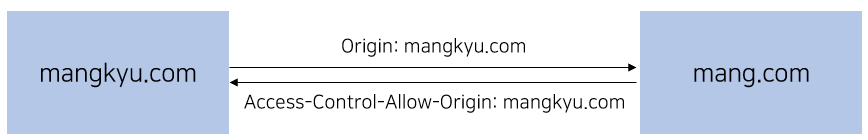
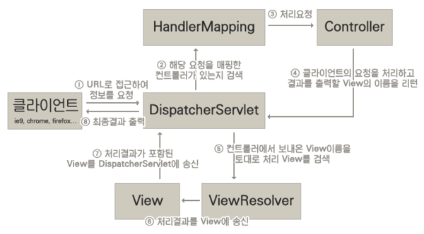
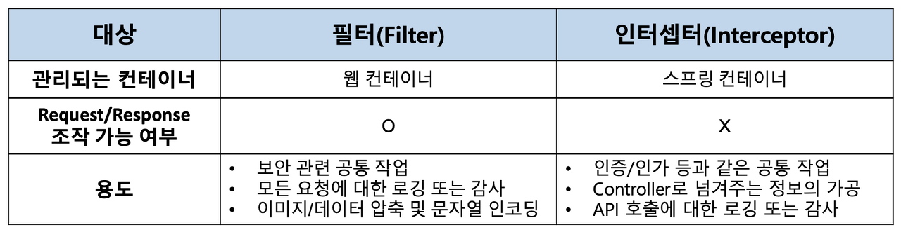
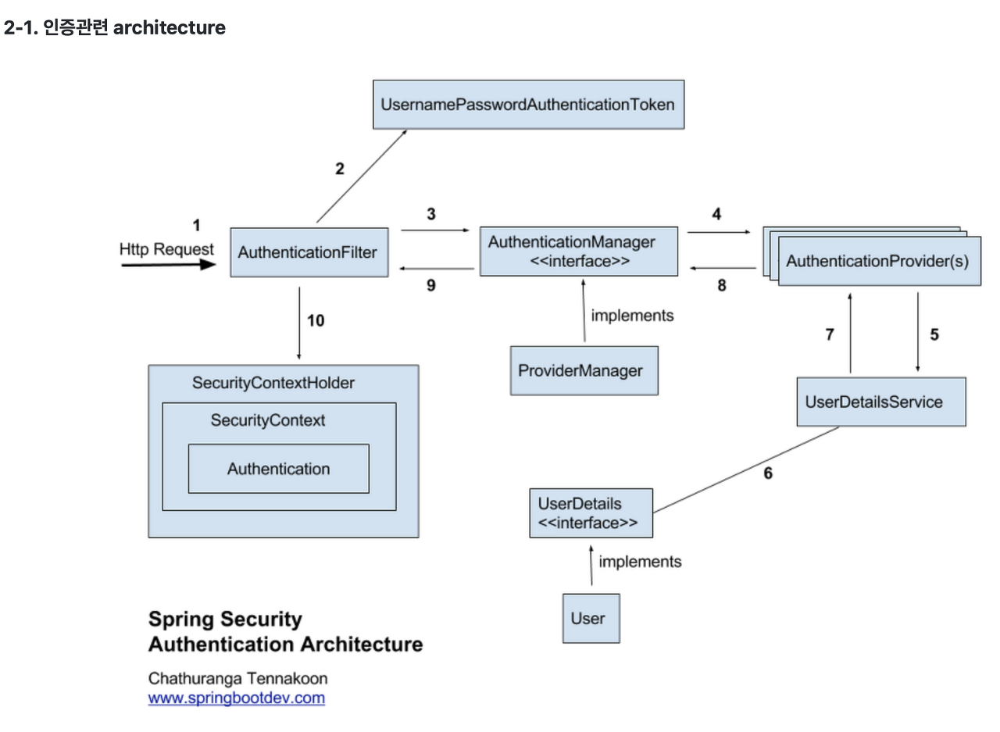
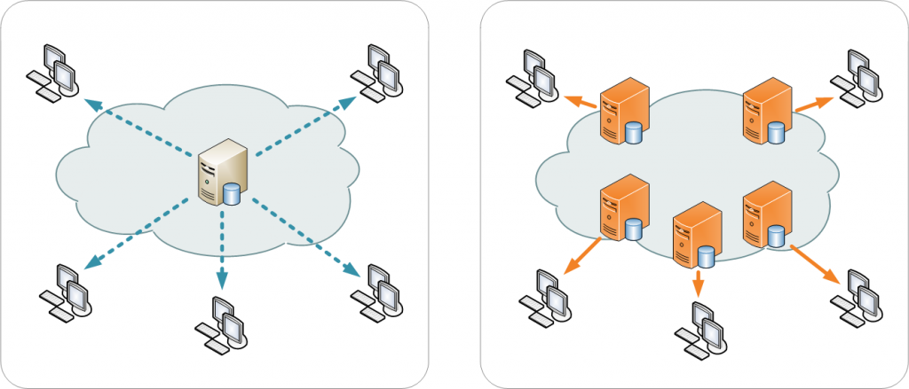

# 8. 백엔드(Spring 위주)
   
### [ WAS와 WS의 차이 ]
   
- WAS(Web Application Server)
  - 비지니스 로직을 넣을 수 있음 
  - Tomcat, PHP, ASP, .Net 등
- WS(Web Server)
  - 비지니스 로직을 넣을 수 없음
  - Nginx, Apache 등


### [ 많은 트래픽이 발생한 경우 대처하는 방법 ]

- 스케일 업(Scale Up): 서버에 CPU나 RAM 등을 추가하여 서버의 하드웨어 스펙을 향상시키는 방법이다.
- 스케일 아웃(Scale Out): 서버를 여러 대 추가하여 시스템을 증가시키는 방법이다.


### [ CORS 란? ]
CORS(Cross-Origin-Resource-Sharing)란 도메인이 다른 2개의 사이트가 데이터를 주고 받을 때 발생하는 문제입니다. 예를 들어 mangkyu.com에서 mang.com으로 데이터를 요청한다고 하면, 따로 설정을 해주지 않는 한 CORS 에러를 만나게 됩니다.

CORS가 생기게 된 이유는 서버 내에서 요청이 허락된 도메인에만 데이터를 주기 위해서인데, 요청을 허락하기 위해서는 Access-Control-Alow-Origin: {도메인} 과 같은 내용을 Response의 헤더에 추가해주어야 합니다다. 만약 도메인을 *으로 설정하면 모든 도메인에 대해 요청을 허락할 수 있습니다. 그 외에도  Access-Control-Allow-Methods, Access-Control-Max-Age 등을 설정해줄 수 있습니다.

- Access-Control-Allow-Orgin : 요청을 보내는 페이지의 출처 [ *, 도메인 ]
- Access-Control-Allow-Methods : 요청을 허용하는 메소드. Default : GET, POST
- Access-Control-Max-Age : 클라이언트에서 preflight 요청 (서버의 응답 가능여부에 대한 확인) 결과를 저장할 시간
- Access-Control-Allow-Headers : 요청을 허용하는 헤더



### [ 아파치는 멀티 프로세스인가 멀티 쓰레드인가? ]
아파치는 기본적으로 멀티 프로세스로 구현되어 있다. 하지만 설정에 따라 멀티 쓰레드를 같이 운용할 수 있다.


### [ 톰캣은 멀티 프로세스인가 멀티 쓰레드인가? ]
톰캣은 요청을 처리하기 위한 쓰레드 풀을 관리하고 있다. 그리고 요청이 오면 해당 쓰레드 풀에서 쓰레드를 꺼내 요청을 처리하도록 한다.


### [ 디자인 패턴 ]

- 생성 패턴
  - 팩토리 패턴: 객체를 생성하기 위한 디자인 패턴
  - 추상 팩토리 패턴: 객체를 생성하는 팩토리를 생성하기 위한 디자인 패턴
  - 빌더 패턴: 상황에 따라 동적인 인자를 필요로 하는 객체를 생성하기 위한 디자인 패턴
  - 싱글톤 패턴: 객체를 1개만 생성하여 항상 참조가능하도록 고안된 디자인 패턴
- 구조 패턴
  - 어댑터 패턴: 호환성이 맞지 않는 두 클래스를 연결하여 사용하기 위한 디자인 패턴
  - 프록시 패턴: 어떤 객체에 접근하기 위해 대리인을 사용하는 디자인 패턴
  - 데코레이터 패턴
  - 퍼사드 패턴: 어떤 복합적인 기능에 대해 간략화된 인터페이스를 제공하는 디자인 패턴
- 행위 패턴
  - 전략 패턴: 상황에 따라 다른 전략을 사용하기 위한 디자인 패턴
  - 옵저버 패턴: 값을 관찰하여 빠르게 반영하기 위한 디자인 패턴
  - 커맨드 패턴: 실행될 기능을 캡슐화하여 재사용성이 높은 클래스를 설계하기 위한 디자인 패턴

DatabaseController=> SingletonPattern을 사용하여 데이터베이스를 제어하는 하나의 인스턴스만을 생성

DatabasePool => ObjectPool Pattern을 사용하여 데이터베이스 객체를 미리 생성하여 Performance 향상

UnitFactory => FactoryPattern을 사용하여 객체 생성을 최적화 + Singleton Pattern을 사용하여 하나의 공장을 사용

BaseFrame => ObserverPattern을 사용하여 사용자의 정보가 생신되면 View의 값들도 갱신되게 함

PlayerInfo => StrategyPattern을 사용하여 상황에 따라 다른 스킬을 사용


### [ Servlet(서블릿)이란? ]
서블릿이란 클라이언트의 요청을 처리하고, 그 결과를 반환하는 Servlet 클래스의 구현 규칙을 지킨 자바 웹 프로그래밍 기술입니다. Spring MVC에서 Controller로 이용되며, 사용자의 요청을 받아 처리한 후에 결과를 반환합니다.


### [ Spring 기초지식(DI, DL, IoC, AOP) ]

- DI(Dependency Injection): 한 객체에서 다른 객체를 필요로 하여 의존성을 갖게 하는 기술
- DL(Dependency Look-up): 한 객체에서 필요로 하는 다른 객체를 찾아서 사용하는 기술
- IoC(Inversion of Control): 직접 제어야하는 부분에 대한 권한을 프레임워크 등에 넘기는 기술
- AOP(Aspect Oriented Programming): 공통의 관심 사항을 추출하여 원하는 곳에 적용하는 기술


### [ VO와 DTO, BO, DAO란? ]

- DAO(Data Access Object): DB에 접근하여 실제 데이터를 조회 또는 조작하는 클래스, Repository 또는 Mapper에 해당함
- BO(Business Object): 여러 DAO를 활용해 비지니스 로직을 처리하는 클래스, Service에 해당함
- DTO(Data Transfer Object): 데이터를 주고 받기 위해 사용하는 클래스
- VO(Value Object): 실제 데이터만을 저장하는 클래스
  
아래의 예시에서는 완벽하지는 않지만 이해하기에는 충분한 3가지 개념의 코드를 보여주고 있습니다.

```java
@Getter
// 데이터만 저장하는 VO
public class Board {

    private String title;
    private String contents;

}

// DB에 접근하여 데이터를 조회하는 DAO(여기서는 DB쪽 X)
public class BoardRepository {

    private List<Board> boardList = new ArrayList<>();

    public void add(Board board) {
        boardList.add(board);
    }

    public List<Board> findByTitleContaining(String title) {
        return boardList.stream()
                .filter(b -> b.getTitle().contains(title))
                .collect(Collectors.toList());
    }

}

// DAO를 가지고 비지니스 로직을 처리하는 BO
public class BoardService {

    private BoardRepository boardRepository;

    public void addBoard(Board board) {
        boardRepository.add(board);
    }

    public List<Board> searchBoard(String title) {
        return boardRepository.findByTitleContaining(title);
    }

}

```


### [ 디스패처 서블릿(Dispatcher Servlet)이란? ]
디스패처 서블릿이란 톰캣과 같은 서블릿 컨테이너를 통해 들어오는 모든 요청을 제일 앞에서 받는 컨트롤러입니다. 디스패처 서블릿은 공통된 작업을 처리한 후에, 적절한 세부 컨트롤러로 작업을 위임해줍니다. 그리고 각각의 세부 컨트롤러는 처리할 부분을 처리하고 반환할 view를 Dispatcher Servlet에 넘기게 됩니다.



### [ Spring에서의 싱글톤 패턴 ]
Java로 기본적인 싱글톤 패턴을 구현하고자 하면 다음과 같은 단점들이 발생한다.

- private 생성자를 갖고 있어 상속이 불가능하다.
- 테스트하기 힘들다.
- 서버 환경에서는 싱글톤이 1개만 생성됨을 보장하지 못한다.
- 전역 상태를 만들 수 있기 때문에 바람직하지 못하다.

그래서 스프링은 컨테이너를 통해 직접 싱글톤 객체를 생성하고 관리하는데, 이를 통해 다음과 같은 장점을 얻을 수 있다.

- static 메소드나 private 생성자 등을 사용하지 않아 객체지향적 개발을 할 수 있다.
- 테스트를 하기 편리하다.


### [ MVC 패턴이란? ]
MVC(Model-View-Controller)패턴은 아키텍쳐를 설계하기 위한 디자인 패턴입니다.

MVC 패턴은 애플리케이션을 개발할 때 그 구성요소를 3가지로 나눕니다.

- Model: 데이터를 저장하는 컴포넌트
- View: 사용자 인터페이스(UI) 컴포넌트
- Controller: 사용자의 요청을 처리하고 Model과 View를 중개하는 컴포넌트


### [ Spring MVC란? ]
Spring MVC란 웹 애플리케이션 개발을 위한 MVC 패턴 기반의 웹 프레임워크입니다. Spring MVC는 애플리케이션의 구성요소를 Model, View, Controller로 분리합니다. 또한 Spring MVC는 아래와 같은 컴포넌트들로 구성됩니다.

- Dispatcher Servlet: 클라이언트의 요청을 먼저 받아들이는 서블릿으로, 요청에 맞는 컨트롤러에게 요청을 전달함
- Handler Mapping: 해당 요청이 어떤 컨트롤러에게 온 요청인지 검사함
- Controller: 클라이언트의 요청을 받아 처리하여 결과를 디스패처 서블릿에게 전달함
- ViewResolver: View의 이름을 통해 알맞은 View를 찾음
- View: 사용자에게 보여질 UI 화면


### [ Spring MVC 작동 원리 ]


1. 클라이언트는 URL을 통해 요청을 전송한다.
2. 디스패처 서블릿은 핸들러 매핑을 통해 해당 요청이 어느 컨트롤러에게 온 요청인지 찾는다.
3. 디스패처 서블릿은 핸들러 어댑터에게 요청의 전달을 맡긴다.
4. 핸들러 어댑터는 해당 컨트롤러에 요청을 전달한다.
5. 컨트롤러는 비지니스 로직을 처리한 후에 반환할 뷰의 이름을 반환한다.
6. 디스패처 서블릿은 뷰 리졸버를 통해 반환할 뷰를 찾는다.
7. 디스패처 서블릿은 컨트롤러에서 뷰에 전달할 데이터를 추가한다.
8. 데이터가 추가된 뷰를 반환한다.


### [ Spring MVC의 장점과 단점 그리고 SpringBoot]
- 장점
  - 의존성 주입을 통해 컴포넌트 간의 결합도를 낮출 수 있어 단위테스트가 용이함
  - 제어의 역전을 통해 빈(객체)의 라이프싸이클에 관여하지 않고 개발에 집중할 수 있음
- 단점
  - XML을 기반으로 하는 프로젝트 설정은 너무 많은 시간을 필요로 함
  - 톰캣과 같은 WAS를 별도로 설치해주어야 함
- 해결책(Spring Boot)
  - 자동설정(AutoConfiguration)을 도입하여 Dispatcher Servlet 등과 같은 설정 시간을 줄여줌
  - 프로젝트의 의존성을 독립적으로 선택하지 않고 spring-boot-starter로 모아두어 외부 도구들을 사용하기 편리함
  - 내장 톰캣을 제공하여 별도의 WAS를 필요로 하지 않음


### [ Spring @Bean, @Configuration, @Component 어노테이션 ]

- 개발자가 직접 제어가 불가능한 외부 라이브러리 또는 설정을 위한 클래스를 Bean으로 등록할 때 @Bean 어노테이션을 활용
- 1개 이상의 @Bean을 제공하는 클래스의 경우 반드시 @Configuration을 명시해 주어야 함
- 개발자가 직접 개발한 클래스를 Bean으로 등록하고자 하는 경우 @Component 어노테이션을 활용


### [ Spring Filter와 Interceptor의 차이 ]



# 8. 백엔드(Spring 위주) - 고급
   
### [ Spring Security 작동 원리 ]




1. 사용자가 아이디 비밀번호로 로그인을 요청함
2. AuthenticationFilter에서 UsernamePasswordAuthenticationToken을 생성하여 AuthenticaionManager에게 전달
3. AuthenticaionManager는 등록된 AuthenticaionProvider(들)을 조회하여 인증을 요구함
4. AuthenticaionProvider는 UserDetailsService를 통해 입력받은 아이디에 대한 사용자 정보를 DB에서 조회함
5. 입력받은 비밀번호를 암호화하여 DB의 비밀번호화 매칭되는 경우 인증이 성공된 UsernameAuthenticationToken을 생성하여 AuthenticaionManager로 반환함
6. AuthenticaionManager는 UsernameAuthenticaionToken을 AuthenticaionFilter로 전달함
7. AuthenticationFilter는 전달받은 UsernameAuthenticationToken을 LoginSuccessHandler로 전송하고, 토큰을 response의 헤더에 추가하여 반환함


### [ Spring AOP의 작동 원리(JDK 다이나믹 프록시) ]

1. 다이내믹 프록시 객체의 생성 요청
2. 포인트컷을 통해 부가 기능 대상 여부 확인
3. 어드바이스로 부가 기능 적용
4. 실제 기능 처리

Spring AOP는 프록시를 이용하였으며 자바의 기본 JDK와 스프링 컨테이너 외에는 특별한 기술이나 환경을 필요로 하지 않습니다. 하지만 이러한 프록시 방법은 반드시 Spring 컨테이너가 필요하며 부가기능의 처리가 어려운 단점이 있어서, 바이트를 조작하는 AOP가 등장하게 되었습니다.


### [ AspectJ AOP의 작동 원리(CGLib 기반 바이트 조작 프록시) ]
Spring AOP 외에 또 다른 강력한 AOP 프레임워크 중 하나인 AspectJ는 프록시를 이용하지 않았습니다. 대신 AspectJ는 CGlib이라는 바이트 조작 라이브러리를 사용하여 타깃 오브젝트의 바이트를 고쳐서 부가기능을 직접 넣어주는 방법(바이트 조작)을 사용합니다. 그래서 우리가 만든 코드에서는 부가 기능이 분리되어 있지만 바이트 코드에서는 핵심 기능과 부가 기능이 섞여있는 구조입니다. AspectJ가 프록시를 사용하지 않고 CGLib을 이용한 복잡한 바이트 조작 방법을 사용하는 이유는 크게 2가지가 있습니다.

- 바이트 코드를 조작하면 Spring과 같은 컨테이너의 도움이 필요 없기 때문이다.
- 프록시 방식보다 훨씬 강력하고 유연한 AOP를 제공할 수 있다.

### [ Spring WebFlux란? ]
Spring WebFlux란 Blocking+동기 방식으로 동작하는 Spring MVC의 한계점을 극복하기 위해 Spring5에 처음 등장하게 되었습니다. 기존의 Spring MVC에서는 HTTP 요청들을 큐에 넣어두고, 멀티쓰레드를 기반으로 동작하고 있습니다. 하지만 이러한 방식은 응답성이 상대적으로 떨어지기 때문에 비동기적으로 요청을 처리하기 위한 방법이 필요하게 되었고, 리액티브 프로그래밍을 통해 비동기 데이터 스트림으로 Non-Blocking 애플리케이션을 개발하기 위한 Spring WebFlux 프레임워크가 등장하게 되었습니다.


### [ CDN(Content Delivery Network)란? ]


CDN(Content Delivery Network)는 물리적으로 떨어져 있는 사용자에게 컨텐츠를 더 빠르게 제공하기 위해 고안된 기술입니다. 만약 우리나라에 있는 사람이 미국에 있는 서버로부터 이미지나 파일 등을 다운받으려고 하면 시간이 오래 걸립니다. 따라서 느린 응답속도와 다운로드 시간을 극복하기 위해 서버를 분산시켜 캐싱해두고, 빠르게 다운받을 수 있게 합니다.

CDN은 콘텐츠에 대한 요청이 발생하면 사용자와 가장 가까운 위치에 존재하는 서버로 매핑시켜, 요청된 파일의 캐싱된(사전 저장된) 버전으로 요청을 처리합니다. 서버가 파일을 찾는 데 실패하는 경우 CDN 플랫폼의 다른 서버에서 콘텐츠를 찾은 다음 엔드유저에게 응답을 전송합니다.




출처: https://mangkyu.tistory.com/95 [MangKyu's Diary]